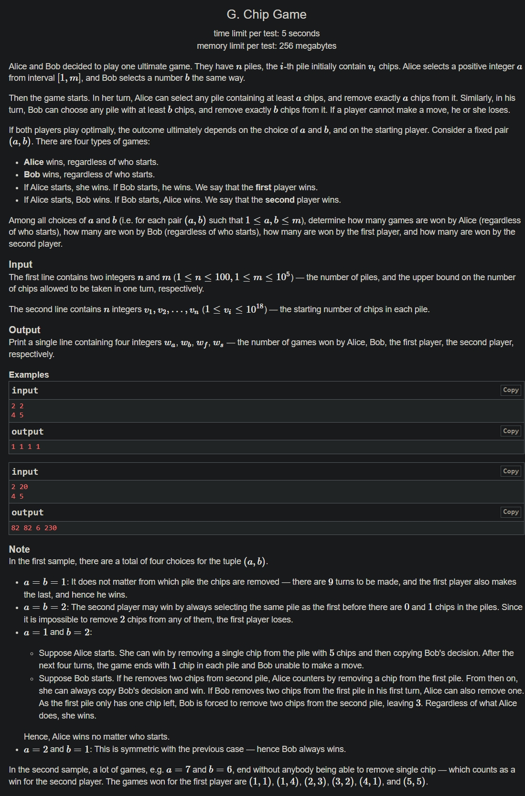

+++
author = "Nitride"
title = "CF1033G Chip Games 題解"
date = "2024-07-28"
tags = [
    "競程",
    "題解",
]
categories = [
    "競程",
]
+++

# 題目
- 連結: [Problem - 1033G - Codeforces](https://codeforces.com/problemset/problem/1033/G)
- 前置知識: 無
- 難度: 3500


# 題解
本題解主要參考自[zsc9852462的題解](https://www.cnblogs.com/zsc985246/p/17331425.html)。本文將我當時看這篇題解有理解困難的地方更加詳細的說明，以及改正原文的一些小錯誤。

首先，我們發現Alice必勝與Bob必勝本質是相同的，皆為$\frac{m^2-w_{f}-w_{s}}{2}$，因此只須考慮先手必勝跟後手必勝的情況。

容易看出將$v_i$對$(a+b)$取模並不會影響結果，因此我們令$w_{i}=v_{i}\mod(a+b)$。

假設$a\leq b$，則$w_i$只可能會是以下4種情況:
1. $0\leq w_{i}<a$: 該堆無法被任何人取
2. $a\leq w_{i}<b$: Alice取完會變情況1，Bob不能取。若$a=b$則不會有此情況。
3. $b\leq w_{i}<2a$: Alice或Bob取完都會變情況1。若$b\geq 2a$則不會有此情況。
4. $max(2a,b)\leq w_{i}<x+y$: Alice取完會變情況2，Bob取完會變情況1。若$a=b$則不會有此情況。

接著對各種情況進行討論。另$c_{i}$為第$i$種類型的堆的數量: 
- $c_{2}\geq 1$: Alice必勝
- $c_{2}=0$
	- $c_{4}\geq 2$: Alice必勝
	- $c_{4}=1$:
		- $c_{3}$為奇數: Alice必勝
		- $c_{3}$為偶數: 先手必勝
	- $c_{4}=0$: 
		- $c_{3}$為奇數: Alice必勝
		- $c_{3}$為偶數: 後手必勝

我們只關心先手必勝跟後手必勝，將其條件整理如下: 
- 先手必勝: $c_{2}=0$且$c_{4}=1$且$c_{3}$為偶數。
- 後手必勝: $c_{2}=0$且$c_{4}=0$且$c_{3}$為偶數。

將以上條件轉換為數學式:
- 先手必勝: $\forall w_{i},w_{i}\notin[a,b),\sum[w_{i}\geq max(2a,b)]=1,\sum[w_{i}\geq b]\mod 1=1$
- 後手必勝: $\forall w_{i},w_{i}\notin[a,b),\sum[w_{i}\geq max(2a,b)]=0,\sum[w_{i}\geq b]\mod 1=0$

我們可以枚舉$sum=a+b$，對$v_{i}$取模後排序$w_{i}$。因為在先手必勝或後手必勝的情況下$\forall w_{i},w_{i}\notin[a,b)$，故存在$i$使得$w_{i}<a,b\leq w_{i+1}$。我們接著枚舉符合此條件的$w_{i}$。

先手必勝時$\sum[w_{i}\geq max(2a,b)]=1$。由於我們已將$w_{i}$排序過，故前式等價於$max(2a,b)>w_{n-1}$。

我們令$w_{n}=sum-1$，即模$sum$下的最大值。如果$b>2a$，代表$w_{n-1}<b\leq w_{n}\implies w_{n-1}<a\leq w_{n}$。因為$b>2a>a$，故也可推得$w_{n-1}<2a\leq w_{n}$。

把$a\leq b$的條件解除，由上面推導我們可得出$a,b\in[l,r]$，其中$l=max\left( w_{i},\left\lfloor  \frac{w_{n-1}}{2}  \right\rfloor \right)+1,r=min(w_{i+1},m)$。再由$b=sum-a$我們可以得到$a\in[max(l,sum-r),min(r,sum-l)]$。

由於一個$a$對應一個$b$，所以$min(r,sum-l)-max(l,sum-r)+1$就是當時枚舉的$sum$對答案的貢獻。

後手同理。

# 完整程式碼
```cpp
#include <bits/stdc++.h>
#define ll long long
using namespace std;

const int maxn = 105;
ll n, m;
ll v[maxn], w[maxn];
int main() {
	cin.tie(0)->sync_with_stdio(0);
	cin >> n >> m;
	for (int i = 1; i <= n; i++) cin >> v[i];

	ll wf = 0, ws = 0;
	for (int sum = 2; sum <= 2 * m; sum++) {
		for (int i = 1; i <= n; i++) w[i] = v[i] % sum;
		sort(w + 1, w + 1 + n);
		w[n + 1] = sum - 1;	// 插入最大值

		for (int i = 0; i <= n; i++) {	// w[i] < a, b <= w[i + 1]
			if ((n - i) & 1) {			// w[i] >= b的數量為奇數，計算先手必勝
				ll l = max(w[i], w[n - 1] / 2) + 1, r = min(w[i + 1], m);
				wf += max(0ll, min(r, sum - l) - max(l, sum - r) + 1);
			} else {					// w[i] >= b的數量為偶數，計算後手必勝
				ll l = max(w[i], w[n] / 2) + 1, r = min(w[i + 1], m);
				ws += max(0ll, min(r, sum - l) - max(l, sum - r) + 1);
			}
		}
	}
	cout << (m * m - wf - ws) / 2 << ' ' << (m * m - wf - ws) / 2 << ' ' << wf << ' ' << ws;
}
```