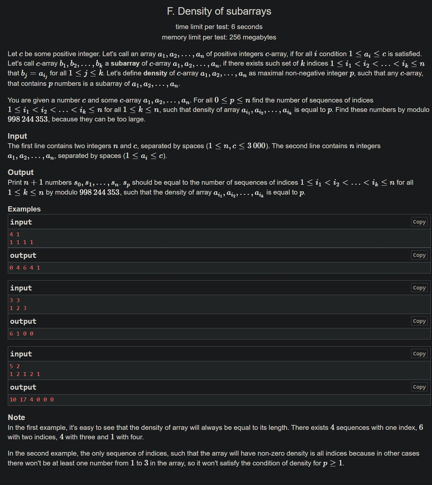

+++
author = "Nitride"
title = "CF1158F Density of Subarrays 題解"
date = "2024-08-10"
tags = [
    "競程",
    "題解",
]
categories = [
    "競程",
]
+++

# 題目
- 連結: [Problem - 1158F - Codeforces](https://codeforces.com/problemset/problem/1158/F)
- 前置知識: Bitmask DP
- 難度: 3500


# 題解
本題解主要參考自[官方題解](https://codeforces.com/blog/entry/66993?locale=en)。

首先，定義$l_{1},l_{2},\dots l_{p}$為，在$a[l_{i}+1\dots l_{i+1}]$中，$[1,c]$中的數字均有出現過，且$a_{l_{i+1}}$恰好出現過一次的下標。稱$a[l_{i}+1\dots l_{i+1}]$為critical array。

由此，若求的出$l_{1},l_{2},\dots l_{p}$，則可得出$a$的密度$\geq p$。

注意到由於$l_{i+1}-l_{i}+1\geq c$，因此長度為$n$的陣列$a$其密度必$\leq k=\frac{n}{c}$。

接著定義$dp[t][i]$為$a[1\dots i]$中「剛好可以分成$t$個critical array」的子序列的數量。

此時我們令$f[t]$為$a$中密度$\geq t$的子序列的數量，得出$f[t]=\sum^n_{i=1}(dp[t][i]\cdot 2^{n-i})$，並可藉此求得答案$res[t]=f[t+1]-f[t]$。

至於要如何求出$dp$，這裡有$2$個方法: 

第$1$個方法可在$O(n^2k)=O\left( \frac{n^3}{c} \right)$的時間內完成。

令$num[i][j]$為$a[i\dots j]$中$a_{j}$僅出現過一次的子序列數，$cnt[x][i][j]$為$x$在$a[i\dots j]$中出現過的次數，則可以得到$num[i][j]=\Pi_{x=1}^c(2^{cnt[x][i][j]}-1)$，因為$x$在$a[i\dots j]$共可以產生$2^{cnt[x][i][j]}$種子序列，且至少$x$至少要出現一次，故減去$1$。

於是就可得到$dp[t][i]$的轉移式:
$$dp[t][i]=\sum_{j=0}^{i-1}(dp[t-1][j]\cdot num[j+1][i])$$

第$2$個方法可在$O\left( nk2^c \right)=O\left( \frac{n^3}{\log n} \right)$時間內完成。

令$u[i][t][mask]$為$a[1\dots i]$中先選取好$t$個critical array，且在最後一個critical array的結尾到$i$之間已有$mask$的元素被選取的子序列數。

則可以得到$dp[t][i]=u[i-1][t-1][2^c-i-2^{a_{i}}]$。

接著我們考慮$u$的轉移式:

$$u[i][t][mask]=\begin{cases}u[i-1][t][mask]&\text{if }a_{i}\text{ is not in mask}\newline2u[i-1][t][mask]+u[i-1][t][mask-2^{a_{i}}]&\text{if }a_{i}\text{ is in mask}\end{cases}$$

由於$u[i][t][mask]$的轉移只會用到$u[i-1]$，故可以節省記憶體空間，使用滾動陣列。

至於當$mask=0$時，$u[i][t][0]=u[i-1][t][0]+dp[t][i]$，即「加入$a_{i}$前就已經完成$t$個critical array」加上「加入$a_{i}$後剛好完成第$t$個critical array」的子序列數。

以上便完成了兩種時間複雜的的解法。在$c>\log_{2}n$時，$\frac{n^3}{c}< \frac{n^3}{\log_{2}n}$，故採用第一種解法；反之則採用第二種解法。如此一來便可通過此題。

# 完整程式碼
```cpp
#include <bits/stdc++.h>
#define ll long long
using namespace std;

const int maxn = 3005;
const int mod = 998244353;
const ll mod2 = (ll)mod * (ll)mod;

void add(int &a, int b) {
    a += b;
    if (a >= mod) a -= mod;
}

int qpow(int a, int b) {
    int res = 1;
    while (b) {
        if (b & 1) res = 1ll * res * a % mod;
        a = 1ll * a * a % mod;
        b >>= 1;
    }
    return res;
}

int n, c, a[maxn];
int cnt[maxn][maxn];        // cnt[i][x + 1] = i在a[1...x]中出現過的次數
int pw[maxn], inv[maxn];
int k, used_cnt;
int dp[maxn][maxn], num[maxn][maxn];
void solve_n2k() {
    for (int i = 0; i <= n; i++) inv[i] = qpow(pw[i] - 1, mod - 2);
    for (int i = 0; i < n; i++) {
        int cur = 1;
        used_cnt = c;
        for (int j = i; j < n; j++) {
            if (cnt[a[j]][i] == cnt[a[j]][j]) used_cnt--;
            else cur = 1ll * cur * inv[cnt[a[j]][j] - cnt[a[j]][i]] % mod;

            if (used_cnt != 0) num[i][j] = 0;
            else num[i][j] = cur;

            cur = 1ll * cur * (pw[cnt[a[j]][j] - cnt[a[j]][i] + 1] - 1) % mod;
        }
    }

    dp[0][0] = 1;
    for (int t = 1; t <= k; t++) {
        for (int i = t * c - 1; i < n; i++) {
            ll sum = 0;
            for (int j = i; j >= (t - 1) * c; j--) {
                sum += 1ll * dp[t - 1][j] * num[j][i];
                if (sum >= mod2) sum -= mod2;
            }
            dp[t][i + 1] = sum % mod;
        }
    }
}

int u[maxn][1 << 10];
void solve_nk2powc() {
    dp[0][0] = 1;
    u[0][0] = 1;
    for (int i = 0; i < n; i++) {
        for (int t = 1; t <= k; t++) dp[t][i + 1] = u[t - 1][((1 << c) - 1) ^ (1 << a[i])];
        int maxt = min(k - 1, (i / c));
        for (int mask = (1 << c) - 1; mask >= 0; mask--) {
            if ((mask >> a[i]) & 1) {
                for (int t = 0; t <= maxt; t++) {
                    add(u[t][mask], u[t][mask]);
                    add(u[t][mask], u[t][mask ^ (1 << a[i])]);
                }
            }
        }
        for (int t = 0; t < k; t++) add(u[t][0], dp[t][i + 1]);
    }
}

int res[maxn];
bool used[maxn];
int main() {
    cin.tie(0)->sync_with_stdio(0);
    cin >> n >> c;
    for (int i = 0; i < n; i++) {
        cin >> a[i];
        a[i]--;
    }

    for (int i = 0; i < c; i++) {
        cnt[i][0] = 0;
        for (int x = 0; x < n; x++) {
            cnt[i][x + 1] = cnt[i][x];
            if (a[x] == i) cnt[i][x + 1]++;
        }
    }

    pw[0] = 1;
    for (int i = 0; i < n; i++) {
        pw[i + 1] = pw[i] + pw[i];
        if (pw[i + 1] >= mod) pw[i + 1] -= mod;
    }

    for (int i = 0; i < n; i++) {
        if (!used[a[i]]) {
            used[a[i]] = 1;
            used_cnt++;
        }
        if (used_cnt == c) {
            used_cnt = 0;
            for (int i = 0; i < c; i++) used[i] = 0;
            k++;
        }
    }

    if (c <= 10) solve_nk2powc();
    else solve_n2k();

    for (int i = 0; i <= k; i++) {
        for (int j = 0; j <= n; j++) {
            add(res[i], 1ll * dp[i][j] * pw[n - j] % mod);
        }
    }

    for (int i = 0; i < n; i++) {
        res[i] -= res[i + 1];
        if (res[i] < 0) res[i] += mod;
    }
    res[0]--;
    if (res[0] < 0) res[0] += mod;
    for (int i = 0; i <= n; i++) cout << res[i] << " ";
}
```