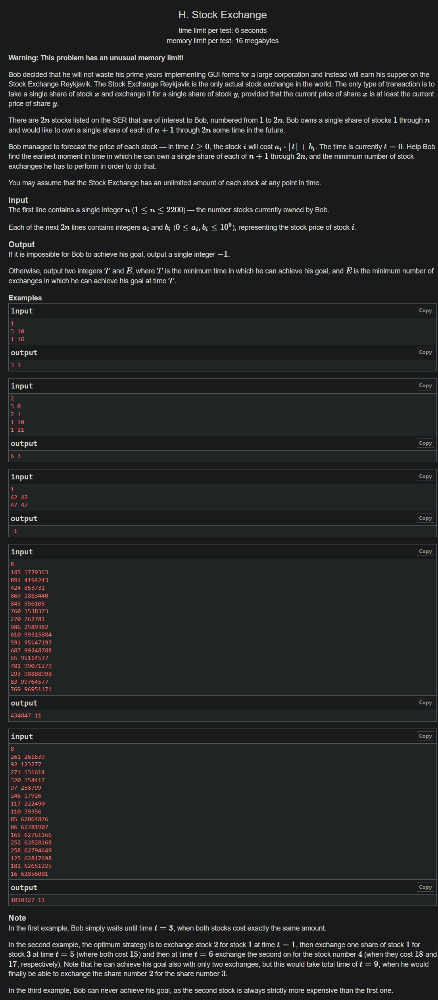

+++
author = "Nitride"
title = "CF1178H Stock Exchange 題解"
date = "2024-08-24"
tags = [
    "競程",
    "題解",
]
categories = [
    "競程",
]
+++

# 題目
- 連結: [Problem - 1178H - Codeforces](https://codeforces.com/problemset/problem/1178/H)
- 難度: 3500
- 前置知識: 二分搜尋、最小費用最大流


# 題解
本題解主要參考自[CF1178H Stock Exchange - ✡smy✡ - 博客园 (cnblogs.com)](https://www.cnblogs.com/smyjr/p/12335580.html)

這題等價於尋找一個$[1,n]$和$[n+1,2n]$之間的二分圖匹配，但是匹配的邊會隨著$t$的變化而改變。

注意到如果一組合法的方案在$t$時刻結束，那麼一定存在一種交換次數不劣於當前方案的方案，使得所有交換都發生在時刻$0$或時刻$t$。

證明: 考慮一組匹配$i\to j$
- 如果在時刻$0$或時刻$t$，$i$的價格$\geq$$j$的價格，就可以使用一次交換解決。
- 否則我們需要在中途換成其他元素，這個元素一定滿足其在時刻$0$的價格$\leq$$i$的價格，且在時刻$t$的價格$\geq$$j$的價格。

考慮第一個問題，我們先二分搜尋結束的時間$t$，並進行二分圖匹配確認時間$t$是否合法。

把所有元素按照時刻$0$的價格由小到大排序，然後$[1,n]$的元素使用貪婪法，選擇在時刻$0$價格不超過它且時刻$t$價格最大的股票。接著開始將所有元素按照時刻$t$的價格由小到大排序，並將$[1,n]$一一對應$[n + 1, 2n]$，若其中一個失配則代表此次二分的時間$t$不合法。

```cpp
bool check(int t) {
  for (int i = 1; i <= 2 * n; i++) ord1[i] = ord2[i] = i;
  sort(ord1 + 1, ord1 + 2 * n + 1, [&](int x, int y) {
  	if (b[x] == b[y]) return k[x] > k[y];
    return b[x] < b[y];
  });

  ll maxy = 0;
  for (int i = 1; i <= 2 * n; i++) {
    maxy = max(maxy, k[ord1[i]] * t + b[ord1[i]]);
    if (ord1[i] <= n) pos[ord1[i]] = maxy;
  }
  sort(pos + 1, pos + 1 + n);

  sort(ord2 + n + 1, ord2 + 2 * n + 1, [&](int x, int y) {
  	return k[x] * t + b[x] < k[y] * t + b[y];
  });
  for (int i = 1; i <= n; i++) {
  	if (pos[i] < k[ord2[i + n]] * t + b[ord2[i + n]]) return 0;
  }
  return 1;
}
```

考慮第二個問題，我們使用最小費用最大流，並連結以下的邊:
- 由源點向$[1,n]$連一條容量為$1$，費用為$0$的邊；
- 由$[n+1,2n]$向匯點連一條容量為$1$，費用為$0$的邊。
- 如果$i$可以在時刻$0$換成$j$，就在左邊連$i\to j$，費用為$1$的邊；
- 如果$i$可以在時刻$t$換成$j$，就在右邊連$i\to j$，費用為$1$的的邊。

但是，這題的空間限制不允許我們這麼做。注意到若存在邊$i\to j$，則代表$i$在該時刻的價格$\geq j$的價格。因此我們可以按照價格由小往大掃，並將所有點向其前面的點連邊即可。

```cpp
void solve(int t) {
  S = ++tim;
  T = ++tim;
  for (int i = 1; i <= 2 * n; i++) {
    in[i] = ++tim;
    out[i] = ++tim;
    if (i <= n) add(S, in[i], 1, 0);
    else add(out[i], T, 1, 0);
    add(in[i], out[i], inf, 0);
  }

  sum[1] = in[ord1[1]];
  for (int i = 2; i <= 2 * n; i++) {
    sum[i] = ++tim;
    add(sum[i], sum[i - 1], inf, 0);
    add(sum[i], in[ord1[i]], inf, 0);
  }
  for (int i = 2; i <= 2 * n; i++) add(in[ord1[i]], sum[i - 1], inf, 1);
  for (int i = 1; i <= 2 * n; i++) ord2[i] = i;
  sort(ord2 + 1, ord2 + 1 + 2 * n, [&](int x, int y) {
    if (k[x] * t + b[x] == k[y] * t + b[y]) return x > y;
    return k[x] * t + b[x] < k[y] * t + b[y];
  });
  sum[1] = out[ord2[1]];
  for (int i = 2; i <= 2 * n; i++) {
    sum[i] = ++tim;
    add(sum[i], sum[i - 1], inf, 0);
    add(sum[i], out[ord2[i]], inf, 0);
  }
  for (int i = 2; i <= 2 * n; i++) add(out[ord2[i]], sum[i - 1], inf, 1);
  mcmf();
}
```

# 完整程式碼
```cpp
#include <bits/stdc++.h>
#define ll long long
using namespace std;
const int maxn = 100005, inf = 0x3f3f3f3f;
int n, S, T, tim, cnt, res;
int in[maxn], out[maxn], id[maxn], head[maxn], dis[maxn], last[maxn], from[maxn];
int ord1[maxn], ord2[maxn], sum[maxn];
queue<int> q;
ll k[maxn], b[maxn], pos[maxn];
bool vis[maxn];
struct Edge {
  int nxt, to, w, c;
} edge[2 * maxn];
void add(int x, int y, int w, int c) {
  edge[++cnt] = {head[x], y, w, c};
  head[x] = cnt;
  edge[++cnt] = {head[y], x, 0, -c};
  head[y] = cnt;
}

bool spfa() {
  memset(dis, inf, sizeof(int) * (tim + 1));
  dis[S] = 0;
  q.push(S);
  while (!q.empty()) {
    int u = q.front();
    q.pop();
    vis[u] = 0;
    for (int i = head[u]; i; i = edge[i].nxt) {
      int to = edge[i].to;
      if (dis[to] > dis[u] + edge[i].c && edge[i].w) {
        dis[to] = dis[u] + edge[i].c;
        from[to] = u, last[to] = i;
        if (!vis[to]) {
          q.push(to);
          vis[to] = 1;
        }
      }
    }
  }
  return dis[T] != inf;
}

void mcmf() {
  while (spfa()) {
    res += dis[T];
    int u = T;
    while (u != S) {
      edge[last[u]].w--;
      edge[((last[u] - 1) ^ 1) + 1].w++;
      u = from[u];
    }
  }
}

bool check(int t) {
  for (int i = 1; i <= 2 * n; i++) ord1[i] = ord2[i] = i;
  sort(ord1 + 1, ord1 + 2 * n + 1, [&](int x, int y) {
  	if (b[x] == b[y]) return k[x] > k[y];
    return b[x] < b[y];
  });

  ll maxy = 0;
  for (int i = 1; i <= 2 * n; i++) {
    maxy = max(maxy, k[ord1[i]] * t + b[ord1[i]]);
    if (ord1[i] <= n) pos[ord1[i]] = maxy;
  }
  sort(pos + 1, pos + 1 + n);

  sort(ord2 + n + 1, ord2 + 2 * n + 1, [&](int x, int y) {
  	return k[x] * t + b[x] < k[y] * t + b[y];
  });
  for (int i = 1; i <= n; i++) {
  	if (pos[i] < k[ord2[i + n]] * t + b[ord2[i + n]]) return 0;
  }
  return 1;
}

void solve(int t) {
  S = ++tim;
  T = ++tim;
  for (int i = 1; i <= 2 * n; i++) {
    in[i] = ++tim;
    out[i] = ++tim;
    if (i <= n) add(S, in[i], 1, 0);
    else add(out[i], T, 1, 0);
    add(in[i], out[i], inf, 0);
  }

  sum[1] = in[ord1[1]];
  for (int i = 2; i <= 2 * n; i++) {
    sum[i] = ++tim;
    add(sum[i], sum[i - 1], inf, 0);
    add(sum[i], in[ord1[i]], inf, 0);
  }
  for (int i = 2; i <= 2 * n; i++) add(in[ord1[i]], sum[i - 1], inf, 1);
  for (int i = 1; i <= 2 * n; i++) ord2[i] = i;
  sort(ord2 + 1, ord2 + 1 + 2 * n, [&](int x, int y) {
    if (k[x] * t + b[x] == k[y] * t + b[y]) return x > y;
    return k[x] * t + b[x] < k[y] * t + b[y];
  });
  sum[1] = out[ord2[1]];
  for (int i = 2; i <= 2 * n; i++) {
    sum[i] = ++tim;
    add(sum[i], sum[i - 1], inf, 0);
    add(sum[i], out[ord2[i]], inf, 0);
  }
  for (int i = 2; i <= 2 * n; i++) add(out[ord2[i]], sum[i - 1], inf, 1);
  mcmf();
}

int main() {
  cin.tie(0)->sync_with_stdio(0);
  cin >> n;
  for (int i = 1; i <= 2 * n; i++) cin >> k[i] >> b[i];
  int l = 0, r = inf;
  while (l + 1 <= r) {
    int mid = (l + r) >> 1;
    if (check(mid)) r = mid;
    else l = mid + 1;
  }
  if (l == inf) {
    cout << "-1";
    return 0;
  }
  cout << l << ' ';
  solve(l);
  cout << res;
}
```