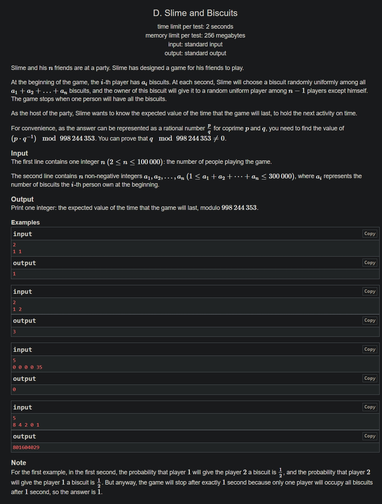

+++
author = "Nitride"
title = "CF1349D Slime and Biscuits 題解"
date = "2024-07-22"
tags = [
    "競程",
    "題解",
]
categories = [
    "競程",
]
+++

# 題目
- 連結: [Problem - 1349D - Codeforces](https://codeforces.com/problemset/problem/1349/D)
- 前置知識: 高斯消元
- 難度: 3200



# 題解
本題解主要參考自[官方題解](https://codeforces.com/blog/entry/77284)

首先令使第$i$個人擁有全部餅乾的期望時間為$E_i$。答案$E$即為$\sum^n_{i=1}E_{i}$。

令$P_{i}$為遊戲結束時所有餅乾在第$i$個人手上的機率。不難得到$\sum^n_{i=1}P_i=0$。

此時我們稍微改變遊戲規則，令遊戲只在第$i$個人拿到所有餅乾時才結束(與原遊戲規則的差別為，$i$以外的人拿到所有餅乾時不會結束)。此時的遊戲的期望時間為$E_i'$。

然後我們再令$C$為當某人持有全部餅乾時，將此人的餅乾全部轉移至另一個人所需的期望時間。此時我們可以得到以下等式: 
$$E_{x}=E_{x}'-\sum^n_{i=1}[i\ne x](P_{i}\cdot C+E_{i})$$
將其移項後即可得到:$$\sum^n_{i=1}E_{i}=E_{x}'-C\sum^n_{i=1}[i \ne x]P_{i}$$
再將上式從$x=1到n$做加總:$$n\sum^n_{i=1}E_{i}=\sum^n_{i=1}E_{i}'-C(n-1)\sum^n_{i=1}P_{i}$$
已知答案$E$為$\sum^n_{i=1}E_{i}$，且$\sum^n_{i=1}P_{i}=1$。故我們可將上式簡化為:$$n \cdot E=\sum^n_{i=1}E_{i}'-C(n-1)$$此時我們令$f_{i}$為當一個人擁有$i$個餅乾時，使此人擁有所有餅乾的期望時間，則我們可以得出$E_{i}'=f_{a_{i}},\,C=f_{0}$。令$m$為總餅乾數，我們不難得出以下遞推式:
$$f_{i}=\begin{cases}
1 + \frac{m-i}{m}\left( \frac{1}{n-1}f_{i+1}+\frac{n-2}{n}f_{i} \right)+\frac{i}{m}f_{i-1}, &0<i<m \newline
1+\frac{1}{n-1}f_{0}+ \frac{n-2}{n-1}f_{1}, &i=0 \newline
0, &i=m\end{cases}$$

然而，我們在透過消元解以上方程式時，可能會出現主元為$0$的情況。為了避免，我們令$g_{i}=f_{i}-f_{i+1},g_{0}=0,g_{m}=0$，可以得出$f_{i}=\sum^m_{j=i}g_{j}$。

於是，我們可以將$f_{i}$在$0<i<m$的情況寫為:$$\sum^m_{j=i}g_{j}=1 + \frac{m-i}{m}\left( \frac{1}{n-1}\sum^m_{j=i+1}g_{j}+\frac{n-2}{n}\sum^m_{j=i}g_{j} \right)+\frac{i}{m}\sum^m_{j=i-1}g_{j}$$
相消之後可以得到:$$g_{i}=1+\frac{(m-i)(n-2)}{m(n-1)}g_{i}+\frac{i}{m}(g_{i}+g_{i-1})$$
$$g_{i}=\frac{m(n-1)+i(n-1)g_{i-1}}{m-i}$$
這樣就不會產生主元為$0$的情況了。

這題還有用鞅與停時定理的解法，有興趣的人可以上網找找看。


# 完整程式碼
```cpp
#include <bits/stdc++.h>
#define ll long long
using namespace std;

const int M = 998244353;
ll qpow(ll a, ll b) {
	ll res = 1;
	while (b) {
		if (b & 1) res = res * a % M;
		a = a * a % M;
		b >>= 1;
	}
	return res;
}

const int maxn = 100005, maxm = 300005;
int n, m;
int a[maxn];
ll res[maxm];
int main() {
	cin.tie(0)->sync_with_stdio(0);
	cin >> n;
	for (int i = 1; i <= n; i++) {
		cin >> a[i];
		m += a[i];
	}

	ll invm = qpow(m, M - 2), invn1 = qpow(n - 1, M - 2);
	for (int i = m; i >= 1; i--) {
		ll k1 = i * invm % M * invn1 % M, k2 = (m - i) * invm % M;
		res[i] = (k2 * res[i + 1] + 1) % M * qpow(k1, M - 2) % M;
	}

	for (int i = 1; i <= m; i++) res[i] = (res[i] + res[i - 1]) % M;
	ll s = 0;
	for (int i = 1; i <= n; i++) s = (s + res[m - a[i]]) % M;
	s = (s + M - res[m] * (n - 1) % M) % M;
	cout << s * qpow(n, M - 2) % M;
}

```