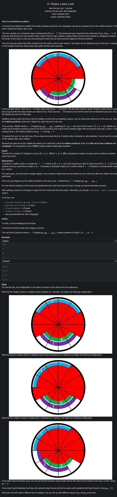

+++
author = "Nitride"
title = "CF1428H Rotary Laser Lock 題解"
date = "2024-07-21"
tags = [
    "競程",
    "題解",
]
categories = [
    "競程",
]
toc = false
+++

# 題目
- 連結: [Problem - 1428H - Codeforces](https://codeforces.com/problemset/problem/1428/H)
- 前置知識: 二分搜尋
- 難度: 3500


# 題解
本題解主要參考自[官方題解](https://codeforces.com/blog/entry/83771)

為了方便起見，我們將把弧順時針旋轉的操作改為將其移至右邊，逆時針旋轉的操作改為將其移至左邊，並以$C_0$代表第0條弧。

本演算法分為兩個階段: 移動階段與搜尋階段。

首先要得出一個重要的結論: 當我們將$C_0$右移時，若未被阻擋的光線$a$較原先增加，則說明$C_0$原先左端點的位置並無其他圓弧。然後我們繼續將$C_0$向右移動，若在一次移動的過程中$a$沒有增加，則說明在這次移動前$C_0$與其他的弧完全重合。此即為移動階段。

此時我們將$C_0$左移1格(即回至與其他弧重疊的位置)，並令其左端點為$x$。

接著進入搜尋階段，開始搜尋與$C_0$重疊的那條弧。令$S$為尚未知道位置的弧(一開始為弧$1到n-1$)的集合，並令$T$為所有可能與$C_0$重疊的弧的集合，以及$F$為待會要左移以測試是否與$C_0$重疊的弧的集合。

至於搜尋的方法則是二分搜尋。將$S$的所有元素放入$T$中，再將$T$中一半的元素放入$F$中，並將$F$中所有的元素左移1格。接著我們將$C_0$左移1格，測試是否有其他弧在$x-1$。

若有的話，則說明與$C_0$重疊的那條弧在$F$中。令$T=F$，再將$T$中一半的元素右移1格，並將右移的元素從$F$中移除，使搜尋範圍減少一半。

若沒有的話，則說明與$C_0$重疊的那條弧在$T-F$中。令$T=T-F$，再將$T$中一半的元素放入$F$，同時向左1格。接著將$C_0$右移1格並重複以上過程，直到$T$只剩下1條弧$C$。

現在我們知道$C$的位置。由於之後的搜索會用到$x-1$這個位置，因此我們將$C$的右端點移至$x-2$以避免干擾。接著我們就可以將$C$移除$S$中，並重新回到移動階段，直到確認所有$n$條弧的位置。

## 查詢次數分析
我們在移動階段時，至多使用$nm-m$次右移，以找到與$C_0$重合的弧，並再至多使用$nm$次移動遍歷整個圓以找到所有的弧。此階段至多使用$2nm-m$次查詢。

進入搜尋階段後，我們每次找到一個新的弧都會使用2次移動以將$C_0$左移再右移，共需要$2n-2$次查詢。接著每次二分搜尋都會使用$2\log_2|T|$次查詢以將$C_0$左移再右移，因此在共計$n-1$次搜尋階段中共會耗費$2n\log_{2} n$次查詢。

接著在二分搜尋中，我們會使用$\frac{n(n-1)}{2}$次查詢。

當找到目標弧後，我們會將其左移$m$或$m+1$格，因此至多使用$(n-1)(m+1)$次移動。

最終我們使用的總查詢次數至多為$2nm-m+2n-2+2n\log_{2} n+\frac{n(n-1)}{2}+(n-1)(m+1)$，由於題目限制$n\leq 100,m\leq 20$，將其帶入後可得出我們最多使用$12636<15000$次查詢。

# 完整程式碼
```cpp
#include <bits/stdc++.h>
using namespace std;

int query(int r, int d) {
    int res ;
    cout << "? " << r << " " << d << '\n' << flush;
    cout.flush();
    cin >> res;
    if (res == -1) exit(1);
    else return res;
}

int n, m;
int relative_pos[105];
int main() {
    cin.tie(0)->sync_with_stdio(0);

    cin >> n >> m;
    int nm = n * m;

    int cur_num = query(0, 1);
    relative_pos[0] = (relative_pos[0] + 1) % nm;

    unordered_set<int> S;
    int i;
    for (i = 1; i < n; i++) S.insert(i);

    int new_num;
    bool increased, stage = 1;  // stage 0 = detection stage, 1 = moving stage

    while (!S.empty()) {
        if (stage) {
            new_num = query(0, 1);
            relative_pos[0] = (relative_pos[0] + 1) % nm;
            if (new_num <= cur_num && increased) {
                new_num = query(0, -1);
                relative_pos[0] = (relative_pos[0] - 1 + nm) % nm;
                stage = 0;
            } else if (new_num > cur_num) increased = 1;
            cur_num = new_num;
        } else {
            int cur_arc = 0;
            unordered_set<int> T(S), F;
            i = 0;
            for (auto it = T.begin(); i < T.size() / 2; i++, it++) {
                F.insert(*it);
                cur_num = query(*it, -1);
            }

            while (T.size() > 1) {
                new_num = query(0, -1);
                relative_pos[0] = (relative_pos[0] - 1 + nm) % nm;
                if (new_num >= cur_num) {
                    T = F;
                    int sz = F.size() / 2;
                    i = 0;
                    for (auto it = F.begin(); i < sz; i++, it++) {
                        cur_num = query(*it, 1);
                        F.erase(*it);
                    }
                } else {
                    for (auto it : T) {
                        if (F.find(it) != F.end()) T.erase(it);
                    }
                    F.clear();
                    i = 0;
                    for (auto it = T.begin(); i < T.size() / 2; i++, it++) {
                        cur_num = query(*it, -1);
                        F.insert(*it);
                    }
                }
                cur_num = query(0, 1);
                relative_pos[0] = (relative_pos[0] + 1) % nm;
            }

            // found the arc
            cur_arc = *T.begin();
            if (!F.empty()) {
                for (i = 0; i < m; i++) {
                    cur_num = query(cur_arc, -1);
                }
                relative_pos[cur_arc] = relative_pos[0] - m - 1;
            } else {
                for (i = 0; i <= m; i++) {
                    cur_num = query(cur_arc, -1);
                }
                relative_pos[cur_arc] = relative_pos[0] - m - 1;
            }

            S.erase(cur_arc);
            stage = 1;
            cur_num = query(0, -1);
            relative_pos[0] = (relative_pos[0] - 1 + nm) % nm;
            increased = 0;
        }
    }

    cout << "! ";
    for (i = 1; i < n; i++) {
        cout << (((relative_pos[i] - relative_pos[0] + nm) % nm) + nm) % nm << ' ';
    }
    cout << '\n' << flush;
}
```