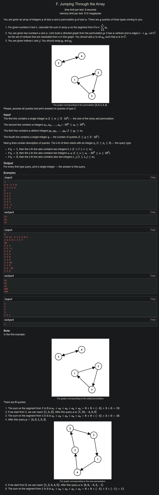

+++
author = "Nitride"
title = "CF1588F Jumping Through the Array 題解"
date = "2024-08-14"
tags = [
    "競程",
    "題解",
]
categories = [
    "競程",
]
+++
# 題目
- 連結: [Problem - 1588F - Codeforces](https://codeforces.com/problemset/problem/1588/F)
- 前置知識: 強連通分量、根號分塊
- 難度: 3500

# 題解
本題解主要參考自[CF1588F Jumping Through the Array - 洛谷专栏 (luogu.com.cn)](https://www.luogu.com.cn/article/9nhtn587)

考慮將每B個操作分成一塊，共分為$\frac{q}{B}$塊，且每次在訪問新的塊時都先將先前的計算結果刪除。

接著，將目前所在的塊中操作2和操作3的目標節點標記，並對所有打上標記的點與「可以到達該點且沒有標記」的點進行縮點。

最後就可以來考慮各操作:
- 對於操作1，分別計算每個強連通分量中有多少的點在$[l,r]$內，乘上該強連通分量的標記後，再加上原區間和。
- 對於操作2，我們在縮好的點上打標記。
- 對於操作3，直接暴力交換即可。

時間複雜度為$O\left( \frac{m}{B}(n+B+B\log B) \right)$。當$B=\sqrt{ \frac{n}{\log n} }$時，複雜度為$O(n\sqrt{ n\log n })$。此外，我們可以進行$O(B^2)$的預處理，使時間複雜度進一步達到$O(n\sqrt{ n })$

# 完整程式碼
```cpp
#include <bits/stdc++.h>
#define ll long long
using namespace std;
const int maxn = 200005, B = 1000;

struct Query {
  int op, x, y;
} q[maxn];

int n, m, p[maxn];
bool vis[maxn];
ll sum[maxn], tag[maxn], a[maxn];
int id[maxn], nxt[maxn], from[maxn];
vector<int> scc[maxn];

int main() {
  cin.tie(0)->sync_with_stdio(0);
  cin >> n;
  for (int i = 1; i <= n; i++) cin >> a[i];
  for (int i = 1; i <= n; i++) {
    cin >> p[i];
    from[p[i]] = i;
  }
  cin >> m;

  for (int ql = 1, qr; ql <= m; ql += B) {
    for (int i = 1; i <= n; i++) sum[i] = sum[i - 1] + a[i];
    memset(vis, 0, sizeof vis);
    memset(tag, 0, sizeof tag);
    memset(id, 0, sizeof id);
    for (int i = 1; i <= n; i++) scc[i].clear();

    qr = min(m, ql + B - 1);
    for (int i = 1; i <= qr - ql + 1; i++) {
      cin >> q[i].op >> q[i].x >> q[i].y;
      if (q[i].op == 2) vis[q[i].x] = 1;
      if (q[i].op == 3) vis[q[i].x] = vis[q[i].y] = 1;
    }

    int cnt = 0;
    for (int i = 1; i <= n; i++) {
      if (vis[i]) {
        id[i] = ++cnt;
        int x = from[i];
        while (!vis[x]) {
          id[x] = cnt;
          x = from[x];
        }
      }
    }

    for (int i = 1; i <= n; i++) if (vis[i]) nxt[id[i]] = id[p[i]];
    for (int i = 1; i <= n; i++) scc[id[i]].push_back(i);
    for (int i = 1; i <= qr - ql + 1; i++) {
      if (q[i].op == 1) {
        ll res = 0;
        for (int j = 1; j <= cnt; j++) {
          res += 1ll * tag[j] * max(0ll, 1ll * (lower_bound(scc[j].begin(), scc[j].end(), q[i].y + 1) - scc[j].begin() - (lower_bound(scc[j].begin(), scc[j].end(), q[i].x) - scc[j].begin())));
        }
        cout << res + sum[q[i].y] - sum[q[i].x - 1] << '\n';
      } else if (q[i].op == 2) {
        int x = id[q[i].x], y = x;
        do {
        	tag[y] += q[i].y;
        	y = nxt[y];
        } while (y && y != x);
      } else {
        swap(nxt[id[q[i].x]], nxt[id[q[i].y]]);
        swap(from[p[q[i].x]], from[p[q[i].y]]);
        swap(p[q[i].x], p[q[i].y]);
      }
    }
    for (int i = 1; i <= n; i++) a[i] += tag[id[i]];
  }
}
```