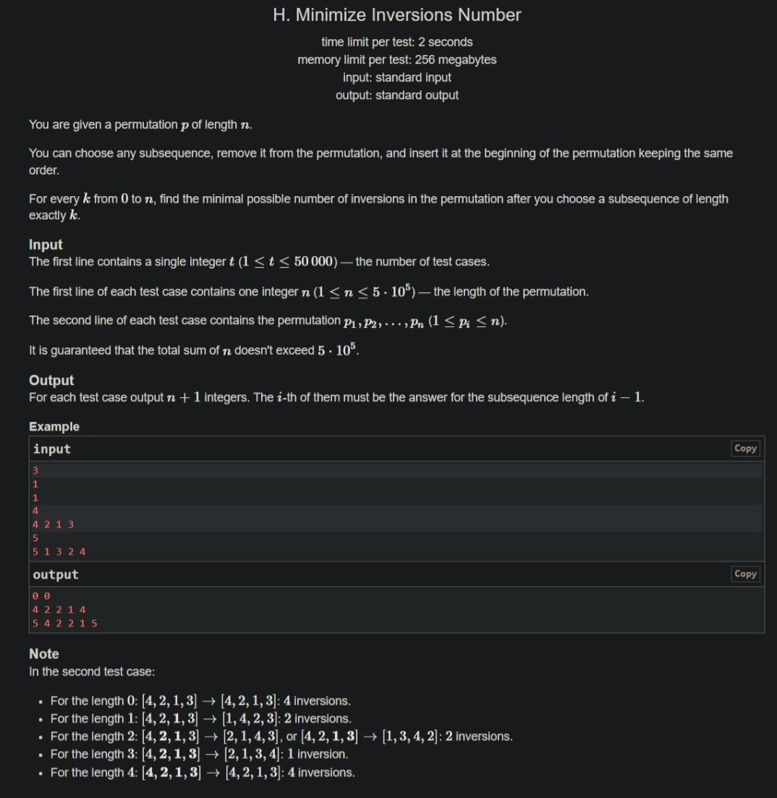

+++
author = "Nitride"
title = "CF1637H Minimize Inversions Number 題解"
date = "2024-07-20"
tags = [
    "競程",
    "題解",
]
categories = [
    "競程",
]
+++

# 題目
- 連結: [Problem - 1637H - Codeforces](https://codeforces.com/problemset/problem/1637/H)
- 前置知識: 樹狀數組
- 難度: 3500


# 題解
本文主要參考自[小粉兔的題解](https://www.cnblogs.com/PinkRabbit/p/CF1637.html)

**首先考慮$k=1$的情況**
- 當我們選取一個數$p_i$移至序列的最前方時，減少的逆序對數為$\sum^{i-1}_{j=1}[p_{j}>p_{i}]-\sum^{i-1}_{j=1}[p_{j}<p_{i}]$，即$p_i$ 在原先位置與其前方的元素所產生的逆序對數減去順序對數(後方的元素因將$p_i$ 移至前方後相對位置不改變，因此不會影響原序列的逆序對數)。
- 我們將這個數記為$d_{i}$。至於要怎麼得到$d_i$，我們可以利用樹狀數組，並同時得到原序列的逆序對數$inv$。
- 顯然，當$k=1$時，答案即為最大的$d_{i}$。

**接著考慮$k\ge2$的情況**
- 當我們依序將選取的元素$q_{1},q_{2},\dots,q_{k}$移至前方時，每個元素分別使整個序列減少的逆序對數為選取的子序列的$d_{i}$之和，即$\sum^k_{j=1}d_{i_{j}}$；然而當我們將子序列移至前方時，子序列內部元素彼此之間的相對位置並不會改變，而我們原先計算的$\sum^k_{j=1}d_{i_{j}}$會記入子序列內部的影響，因此實際上減少的量需再扣除子序列內部的逆序對數減去順序對數，故實際上的原序列的逆序對數為$inv-[\sum^k_{j=1}d_{i_{j}}-inv_{q}+(C^k_{2}-inv_{q})]$，其中$inv_{q}$為選取的子序列內部的逆序對數，$C^k_{2}-inv_{q}$為選取的子序列內部的順序對數
- 整理一下即可得到需最大化$\sum^k_{j=1}d_{i_{j}}-2inv_{q}$

這裡我們需要一個關鍵結論: 對於每個逆序對$(i, j)$(即$i<j且p_{i}>p_{j}$)，若$i$被選取在子序列中，則將$j$也選取在子序列中必使答案不更劣。我們使用反證+調整法證明: 
- 若存在逆序對$(i, j)$且$i$被選取而$j$未被選取，我們考慮其中$j-i$最小的那一對
- 由此可得到$i,j$之間不存在以下元素，否則將與$j-i$的最小性矛盾
	- 值在$p_{j}與p_{i}$之間的元素
	- 值大於$p_{i}$而未被選取的元素
	- 值小於$p_{j}$而未被選取的元素
- 若在子序列中移除$p_{i}$並加入$p_{j}$，此時我們考慮任意元素$p_{k}$對最終逆序對數的影響: 
	- 若$k<i$且$p_{k}$被選取，則$p_{k}$與$p_{i},p_{j}$的相對位置無變化，貢獻為$0$
	- 若$k<i$且$p_{k}$未被選取，則只有在$p_{j}<p_{k}<p_{i}$時會有貢獻$-2$，否則為$0$
	- 若$k>j$且$p_{k}$被選取，則$p_{k}$與$p_{i},p_{j}$的相對位置無變化，貢獻為$0$
	- 若$k>j$且$p_{k}$未被選取，則只有在$p_{j}<p_{k}<p_{i}$時會有貢獻$-2$，否則為$0$
	- 若$i<k<j$，則只有「$p_{k}>p_{i}且p_{k}被選取$」或「$p_{k}<p_{j}且p_{k}未被選取$」時，才有貢獻$1$，否則為$-1$；然而前文已說明不存在「$p_{k}>p_{i}且p_{k}被選取$」或「$p_{k}<p_{j}且p_{k}未被選取$」的情況。
- 因此，若存在逆序對$(i, j)$且$i$被選取而$j$未被選取，我們可刪除$i$並加入$j$，此時答案一定不更劣。加上$(i,j)$本身從逆序對變為順序對會對答案有$-1$的貢獻，因此總變化量必為負數。
- 由於每次調整後子序列的下標和必增加，故調整法會在有限步內結束，證畢。

因此，前文需最大化的$\sum^k_{j=1}d_{i_{j}}-2inv_{q}$可以改為$\sum^k_{j=1}\sum^n_{s=i_{j}+1}[p_{s}<p_{i_{j}}]$

令$c_{i}=d_{i}-2\sum^n_{j=i+1}[p_{j}<p_{i}]$，將$\sum^k_{j=1}c_{i_{j}}$最大化即可。我們將$c$由大到小排序後逐個選取即可得到答案。

時間複雜度為$O(n\log n)$


# 完整程式碼
```cpp[](<#include %3Cbits/stdc++.h%3E
#define ll long long
using namespace std;

const int maxn = 500005;
int n, p[maxn], c[maxn], bit[maxn];

void add(int i, int v) {
	while (i <= n) {
		bit[i] += v;
		i += i & -i;
	}
}

int query(int i) {
	int res = 0;
	while (i) {
		res += bit[i];
		i -= i & -i;
	}
	return res;
}

void solve() {
	cin >> n;
	for (int i = 1; i <= n; i++) cin >> p[i];
	memset(bit + 1, 0, sizeof(int) * n);

	ll inv = 0;
	// 首先計算原序列(k=0)的逆序對數，並順便考慮k=1的情況
	for (int i = 1; i <= n; i++) {
		int a = query(p[i]);	// 順序對
		inv += i - 1 - a;		// 逆序對
		c[i] = i - 1 - 2 * a;	// 逆序對-順序對=把i移到前面會減少的逆序對數
								// 當k=1時，c[i]即為題解中的d[i]
		add(p[i], 1);
	}
	cout << inv << ' ';

	memset(bit + 1, 0, sizeof(int) * n);
	for (int i = n; i >= 1; i--) {
		c[i] -= 2 * query(p[i]);
		add(p[i], 1);
	}

	// 對於每個k(1~n)，答案為原序列的逆序對數-(1到k的c[i]總和)-k(k-1)/2
	// 其中k(k-1)/2=1+2+3+...+k-1
	sort(c + 1, c + 1 + n, greater<>());
	for (int i = 1; i <= n; i++) {
		inv -= c[i] + i - 1;
		cout << inv << ' ';
	}
	cout << '\n';
}

int main() {
	ios::sync_with_stdio(0);
	cin.tie(0);

	int t;
	cin >> t;
	while (t--) solve();
}>)
```