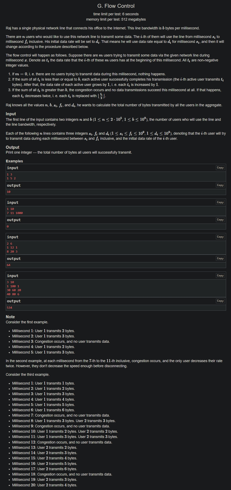

+++
author = "Nitride"
title = "CF1804G Flow Control 題解"
date = "2024-07-31"
tags = [
    "競程",
    "題解",
]
categories = [
    "競程",
]
+++

# 題目
- 連結: [Problem - 1804G - Codeforces](https://codeforces.com/problemset/problem/1804/G)
- 前置知識: 線段樹
- 難度: 3500



# 題解
本題解主要參考自[CF1804G - 洛谷专栏 (luogu.com.cn)](https://www.luogu.com.cn/article/xv1whmdb)

根據題意，此題需要以下操作: 
1. 加入一個用戶
2. 刪除一個用戶
3. 全體加$1$
4. 全體除$2$
5. 求全體和

對於全體除$2$操作，我們找到一個元素均相同的區間，接著全體減去該值的一半即可。由此可知，以上操作均可以透過線段樹(Segment Tree)完成。

我們先將時間離散化，用掃描線遍歷所有加入/刪除用戶的時間點，接著根據兩個時間點的差進行計算即可。若此時所有元素的總和$>b$，則全體除$2$；否則全體加$1$。我們發現以上操作可構成一個循環，可藉此提高運算速度。

詳細內容可見程式碼註解。


# 完整程式碼
```cpp
#include <bits/stdc++.h>
#define ll long long
using namespace std;

const int maxn = 200005;
int n, b;
int s[maxn], f[maxn], d[maxn];
int tim[maxn << 1], t;
vector<int> add[maxn << 1], del[maxn << 1];
ll res;

struct SegmentTree {
	int mx[maxn << 2], mn[maxn << 2], lazy[maxn << 2], cnt[maxn << 2];
	ll sum[maxn << 2];
	#define lc (i << 1)
	#define rc (i << 1 | 1)
	void pushup(int i) {
		sum[i] = sum[lc] + sum[rc];
		mx[i] = max(mx[lc], mx[rc]);
		mn[i] = min(mn[lc], mn[rc]);
		cnt[i] = cnt[lc] + cnt[rc];
	}

	void add(int i, int v) {
		sum[i] += 1ll * cnt[i] * v;
		mx[i] += v;
		mn[i] += v;
		lazy[i] += v;
	}

	void pushdown(int i) {
		if (!lazy[i]) return;
		add(lc, lazy[i]);
		add(rc, lazy[i]);
		lazy[i] = 0;
	}

	void upd(int i, int l, int r, int p, int v, int c) {
		if (l == r) {
			sum[i] = mx[i] = mn[i] = v;
			cnt[i] = c;
		} else {
			pushdown(i);
			int mid = l + r >> 1;
			if (mid >= p) upd(lc, l, mid, p, v, c);
			else upd(rc, mid + 1, r, p, v, c);
			pushup(i);
		}
	}

	void upd_add(int i, int l, int r, int ql, int qr, int v) {
		if (ql <= l && r <= qr) add(i, v);
		else {
			pushdown(i);
			int mid = l + r >> 1;
			if (mid >= ql) upd_add(lc, l, mid, ql, qr, v);
			if (mid < qr) upd_add(rc, mid + 1, r, ql, qr, v);
			pushup(i);
		}
	}

	void upd_div(int i, int l, int r, int ql, int qr) {
		// 此區間都是同一個值，直接區間減
		if (ql <= l && r <= qr && (mn[i] + 1) / 2 == (mx[i] + 1) / 2) {
			add(i, -(mn[i] + 1) / 2);
			return;
		}
		pushdown(i);
		int mid = l + r >> 1;
		if (mid >= ql) upd_div(lc, l, mid, ql, qr);
		if (mid < qr) upd_div(rc, mid + 1, r, ql, qr);
		pushup(i);
	}

	void solve(int interval) {
		if (cnt[1] == 0) return;
		while (interval && sum[1] > b) {
			interval--;
			upd_div(1, 1, n, 1, n);
		}

		while (interval) {
			int curmin = mn[1], curmax = mx[1];
			int k = min((int)(b - sum[1]) / cnt[1] + 1, interval);
			ll s = sum[1] * k + 1ll * cnt[1] * k * (k - 1) / 2;
			upd_add(1, 1, n, 1, n, k);
			interval -= k;
			res += s;
			while (interval && sum[1] > b) {
				interval--;
				k++;
				upd_div(1, 1, n, 1, n);
			}
			if (mn[1] == curmin && mx[1] == curmax) {
				res += s * (interval / k);
				interval %= k;
			}
		}
	}
} st;

int main() {
	cin.tie(0)->sync_with_stdio(0);
	cin >> n >> b;
	for (int i = 1; i <= n; i++) {
		cin >> s[i] >> f[i] >> d[i];
		f[i]++;
		tim[++t] = s[i];
		tim[++t] = f[i];
	}

	// 離散化
	sort(tim + 1, tim + 1 + t);
	t = unique(tim + 1, tim + 1 + t) - tim - 1;
	for (int i = 1; i <= n; i++) {
		s[i] = lower_bound(tim + 1, tim + 1 + t, s[i]) - tim;
		f[i] = lower_bound(tim + 1, tim + 1 + t, f[i]) - tim;
		add[s[i]].emplace_back(i);
		del[f[i]].emplace_back(i);
	}

	for (int i = 1; i < t; i++) {
		for (int j = 0; j < add[i].size(); j++) {
			st.upd(1, 1, n, add[i][j], d[add[i][j]], 1);
		}
		for (int j = 0; j < del[i].size(); j++) {
			st.upd(1, 1, n, del[i][j], 0, 0);
		}
		st.solve(tim[i + 1] - tim[i]);
	}
	cout << res;
}
```