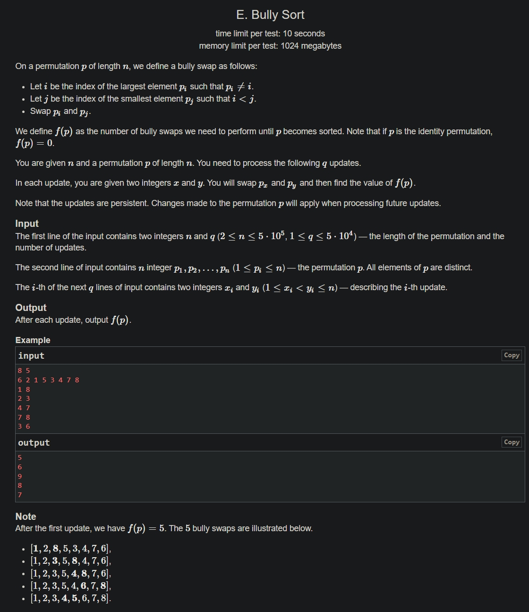

+++
author = "Nitride"
title = "CF1830E Bully Sort 題解"
date = "2024-07-28"
tags = [
    "競程",
    "題解",
]
categories = [
    "競程",
]
+++

# 題目
- 連結: [Problem - 1830E - Codeforces](https://codeforces.com/problemset/problem/1830/E)
- 前置知識: CDQ分治
- 難度: 3500


# 題解
本題解主要參考自[Alex_Wei的題解](https://www.luogu.com.cn/article/sx8w4qm3)。

由於發現一個數的移動次數太難直接求得，因此嘗試找尋不變量或易求出的量的關係。

考慮兩個易取得的量$\sum\mid i-p_{i}\mid$跟逆序對數$\sum_{i<j}[p_{i}>p_{j}]$，前者可以透過線性維護，後者可以透過CDQ分治取得。

根據題意我們可以發現$i<p_{i},i\geq p_{j},j\leq p_{i},j>p_{j}$。在$(i, j)$的$1$次交換中，會使$\sum\mid i-p_{i}\mid$減少$\mid i-p_{i}|+|j-p_{j}|-|j-p_{i}|-|i-p_{j}|=2(j-i)$，逆序對數$\sum_{i<j}[p_{i}>p_{j}]$減少$2(j-i)-1$。

在總共$f(p)$次交換中，$\sum\mid i-p_{i}\mid$共會減少$2f(p)(j-i)$，$\sum_{i<j}[p_{i}>p_{j}]$共會減少$2f(p)(j-i)-f(p)$。顯然這兩個量在排序完成時都會是$0$。由此可得$f(p)=\sum\mid i-p_{i}\mid-\sum_{i<j}[p_{i}>p_{j}]$。

時間複雜度$O(n\log n+q\log^2n)$

# 完整程式碼
```cpp
#include <bits/stdc++.h>
#define ll long long
using namespace std;

const int maxn = 500005, maxq = 50005;
int n, q;
int cnt;
int p[maxn];
int coe[maxq];
int bit[maxn];
void add(int i, int v) {
  while (i <= n) {
    bit[i] += v;
    i += i & -i;
  }
}

int query(int i) {
  int res = 0;
  while (i) {
    res += bit[i];
    i -= i & -i;
  }
  return res;
}

int query(int l, int r) {
  return query(r) - query(l - 1);
}

struct {
  int x, y, z, w, id;
} c[maxn + maxq * 6], d[maxn + maxq * 6];

ll inv[maxq], res[maxq];
void solve(int l, int r) {
  if (l == r || r <= n) return;
  int mid = l + r >> 1;
  if (l == 1 && r == cnt) mid = n;
  solve(l, mid);
  solve(mid + 1, r);
  int pl = l, pr = mid + 1, p = l;
  auto ml = [&]() {
    if (!c[pl].id) add(c[pl].y, c[pl].w);
    d[p++] = c[pl++];
  };

  auto mr = [&]() {
    if(c[pr].id) inv[c[pr].id] += c[pr].w * query(c[pr].y, c[pr].z);
    d[p++] = c[pr++];
  };

  while (pl <= mid && pr <= r) {
    if (c[pl].x <= c[pr].x) ml();
    else mr();
  }

  while (pl <= mid) ml();
  while (pr <= r) mr();
  for (int i = l; i <= mid; i++) {
    if (!c[i].id) add(c[i].y, -c[i].w);
  }
  for (int i = l; i <= r; i++) c[i] = d[i];
}

int main() {
  cin.tie(0)->sync_with_stdio(0);
  cin >> n >> q;
  for(int i = 1; i <= n; i++) {
    cin >> p[i];
    res[0] += abs(i - p[i]);
    add(p[i], 1);
    inv[0] += i - query(p[i]);
    c[++cnt] = {i, p[i], 0, 1, 0};
  }
  for (int i = 1; i <= n; i++) bit[i] = 0;

  for (int i = 1; i <= q; i++) {
    int x, y;
    cin >> x >> y;
    res[i] = res[i - 1];
    res[i] -= abs(p[x] - x) + abs(p[y] - y);
    res[i] += abs(p[x] - y) + abs(p[y] - x);
    int mn = min(p[x], p[y]), mx = max(p[x], p[y]);
    coe[i] = p[x] > p[y] ? -1 : 1;
    c[++cnt] = {x, p[x], 0, -1, 0};
    c[++cnt] = {y, p[y], 0, -1, 0};
    c[++cnt] = {x, p[y], 0, 1, 0};
    c[++cnt] = {y, p[x], 0, 1, 0};
    if (x + 1 < y) {
      c[++cnt] = {x, mn, mx, -1, i};
      c[++cnt] = {y - 1, mn, mx, 1, i};
    }
    swap(p[x], p[y]);
  }
  solve(1, cnt);
  for (int i = 1; i <= q; i++) {
    inv[i] = (inv[i] * 2 + 1) * coe[i] + inv[i - 1];
    cout << (res[i] - inv[i]) << '\n';
  }
}
```