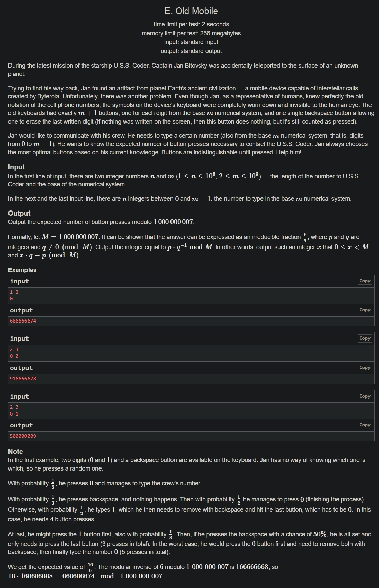

+++
author = "Nitride"
title = "CF1835E Old Mobile 題解"
date = "2024-07-28"
tags = [
    "競程",
    "題解",
]
categories = [
    "競程",
]
+++

# 題目
- 連結: [Problem - 1835E - Codeforces](https://codeforces.com/problemset/problem/1835/E)
- 前置知識: DP
- 難度: 3500


# 題解
本題解主要參考自[tcz_wk在洛谷上的題解](https://www.luogu.com.cn/article/unja3si2)

首先，注意到當一個字符在序列中不是第一次出現，由於我們已在第1次輸入該字符時知道它的鍵位，因此只需再按1次該鍵即可。故我們只需關心這個序列中出現了多少不同的數。

設$C$為序列中出現的不同的字符的集合，大小為$A$；$X$為序列中並未出現，但是鍵盤上有該字符的集合，大小為$B$(等於$m-A$)。

接著根據我們在輸入過程中可能會有的狀況，設立三個$dp$狀態:
- $f[i][j]$表示**已經**知道backspace在哪裡，且剩$i$個$C$中的字符尚未知道位置, $j$個$X$中的字符尚未知道位置，此狀態下輸入完成所需的期望步數。
-  $g[i][j]$表示**尚未**知道backspace在哪裡，目前螢幕上顯示的序列$並非$目標序列的前綴，且剩$i$個$C$中的字符尚未知道位置, $j$個$X$中的字符尚未知道位置，此狀態下輸入完成所需的期望步數。
-  $h[i][j]$表示**尚未**知道backspace在哪裡，目前螢幕上顯示的序列為目標序列的前綴，且剩$i$個$C$中的字符尚未知道位置, $j$個$X$中的字符尚未知道位置，此狀態下輸入完成所需的期望步數。

接下來我們考慮$f[i][j]$的轉移，共3種情況: 
- 有$\frac{1}{i+j}$的機率按下正確的字符，貢獻為$f[i - 1][j] + 1$
- 有$\frac{i-1}{i+j}$的機率按下錯誤的字符，且該字符在$C$中，貢獻為$f[i-1][j]+3$。加3是因為按下這個鍵後，要按backspace把它刪掉，等之後再遇到時還要再按一次。
- 有$\frac{j}{i+j}$的機率按下錯誤的字符，且該字符在$X$中，貢獻為$f[i][j-1]+2$

考慮$g[i][j]$的轉移，共3種情況:
- 有$\frac{1}{i+j+1}$的機率按下backspace，貢獻為$f[i][j] + 1$
- 有$\frac{i}{i+j+1}$的機率按下$C$中的鍵，貢獻為$g[i-1][j]+3$。加$3$的理由跟$f$中提到的一樣。
- 有$\frac{j}{i+j+1}$的機率按下$X$中的鍵，貢獻為$g[i][j-1]+2$

考慮$h[i][j]$的轉移，共4種情況:
- 有$\frac{1}{i+j+1}$的機率按下正確的字符，貢獻為$h[i-1][j]+1$
- 有$\frac{i-1}{i+j+1}$的機率按下不是正確但是位於$C$中的字符，貢獻為$g[i-1][j]+3$
- 有$\frac{j}{i+j+1}$的機率按下$X$中的字符，貢獻為$g[i][j-1]+2$
- 有$\frac{1}{i+j+1}$的機率按下backspace，貢獻為$f[i][j]+2$

最後考慮第$1$步對結果的貢獻。
- 有$\frac{1}{m+1}$的機率按下backspace，貢獻為$f[a][b]+1$
- 有$\frac{1}{m+1}$的機率按下正確的字符，貢獻為$h[a-1][b]+1$
- 有$\frac{a-1}{m+1}$的機率按下錯誤的字符，且該字符在C中(即未來會出現)，貢獻為$g[a-1][b]+3$
- 有$\frac{1}{m+1}$的機率按下錯誤的字符，且該字符在$X$中(即未來不會出現)，貢獻為$g[a][b-1]+2$

記得將答案初始設為$n-a$(即目標序列中不是第一次出現的字符的數量)，因為我們在轉移中不會考慮其對答案的貢獻。

時間複雜度為$O(n^2)$。

個人認為這題難度相較於其他$3500$分的題目，算是簡單了不少，因為本菜雞在看其他$3500$難度的題目時，常常連題解也看不懂.w.


# 完整程式碼
```cpp
#include <bits/stdc++.h>
using namespace std;

const int maxm = 1005;
const int mod = 1e9 + 7;

int n, m;
int inv[maxm];
int f[maxm][maxm], g[maxm][maxm], h[maxm][maxm];
int main() {
  cin.tie(0)->sync_with_stdio(0);
  cin >> n >> m;
  inv[0] = inv[1] = 1;
  unordered_set<int> s;
  for (int i = 2; i <= m + 1; i++) inv[i] = 1ll * inv[mod % i] * (mod - mod / i) % mod;

  for (int i = 1, x; i <= n; i++) {
  	cin >> x;
  	s.insert(x);
  }
  int a = s.size(), b = m - a;

  for (int i = 1; i <= a; i++) {
    for (int j = 0; j <= b; j++) {
      f[i][j] = 1ll * (i - 1) * inv[i + j] % mod * (f[i - 1][j] + 3) % mod;
      f[i][j] = (f[i][j] + 1ll * inv[i + j] * (f[i - 1][j] + 1)) % mod;
      if (j) f[i][j] = (f[i][j] + 1ll * inv[i + j] * j % mod * (f[i][j - 1] + 2)) % mod;
    }
  }

  for (int i = 0; i <= a; i++) {
    for (int j = 0; j <= b; j++) {
      g[i][j] = 1ll * inv[i + j + 1] * f[i][j] % mod;
      if (i) g[i][j] = (g[i][j] + 1ll * inv[i + j + 1] * i % mod * (g[i - 1][j] + 3)) % mod;
      if (j) g[i][j] = (g[i][j] + 1ll * inv[i + j + 1] * j % mod * (g[i][j - 1] + 2)) % mod;
    }
  }


  for (int i = 1; i <= a; i++) {
    for (int j = 0; j <= b; j++) {
      h[i][j] = 1ll * inv[i + j + 1] * (h[i - 1][j] + 1) % mod;
      h[i][j] = (h[i][j] + 1ll * (i - 1) * inv[i + j + 1] % mod * (g[i - 1][j] + 3)) % mod;
      h[i][j] = (h[i][j] + 1ll * inv[i + j + 1] * (f[i][j] + 2)) % mod;
      if (j) h[i][j] = (h[i][j] + 1ll * j * inv[i + j + 1] % mod * (g[i][j - 1] + 2)) % mod;
    }
  }

  int res = n - a;
  res = (res + 1ll * inv[m + 1] * (f[a][b] + 1)) % mod;
  res = (res + 1ll * inv[m + 1] * (h[a - 1][b] + 1)) % mod;
  res = (res + 1ll * inv[m + 1] * (a - 1) % mod * (g[a - 1][b] + 3)) % mod;
  res = (res + 1ll * inv[m + 1] * b % mod * (g[a][b - 1] + 2)) % mod;
  cout << res;
}
```