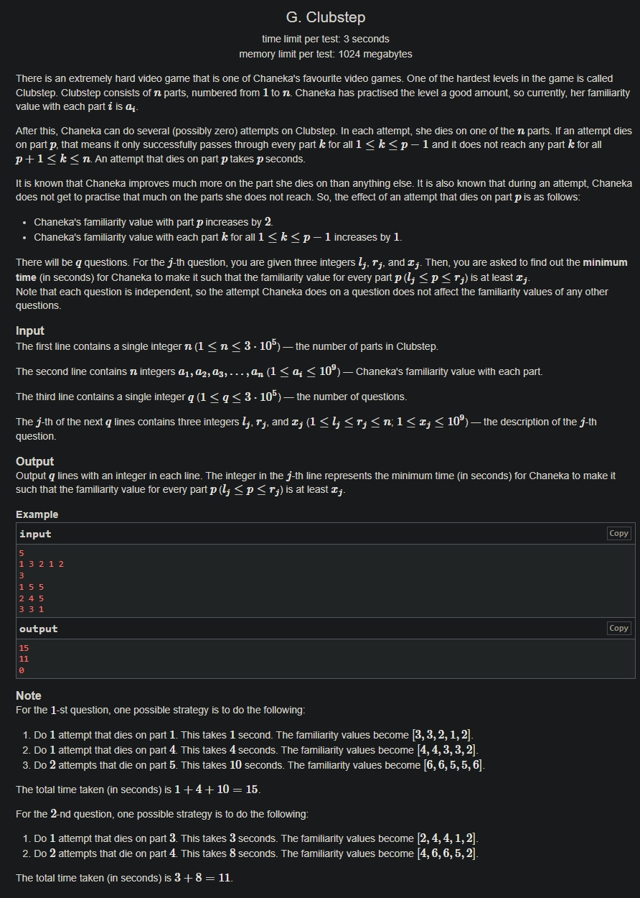

+++
author = "Nitride"
title = "CF1876G Clubstep 題解"
date = "2024-08-13"
tags = [
    "競程",
    "題解",
]
categories = [
    "競程",
]
+++

# 題目
- 連結: [Problem - 1876g - Codeforces](https://codeforces.com/problemset/problem/1876/g)
- 前置知識: 帶權並查集
- 難度: 3500


# 題解
本題解主要參考自[Guizhou H. - 洛谷专栏 (luogu.com.cn)](https://www.luogu.com.cn/article/2xk7em02)

顯然這題可以使用貪婪法。我們對每個問題$(l,r,x)$，先從$r$到$l$掃。若$a_{r}<x$，則該問題的答案相當於$r\cdot \left\lceil  \frac{x-a_{r}}{2}  \right\rceil$加上$\left( l,r-1,\left\lfloor  \frac{x+a_{r}}{2}  \right\rfloor \right)的答案$。

將$i$從$n$枚舉到$1$，並將每個$r=i$的問題依$x$從大到小放入優先佇列中。若$a_{i}<x$，則該問題的答案加上$i\cdot \left\lceil  \frac{x-a_{r}}{2}  \right\rceil$接著再將問題$\left( l,r-1,\left\lfloor  \frac{x+a_{r}}{2}  \right\rfloor \right)$存起來，等$i$變為$r-1$時再重複以上操作。

這裡使用帶權並查集維護答案。若當前題目的$x$與上題的相同，則將此題的父節點設為上題，再將此題的權值減去上題當前的權值(因為之後統計答案時，會將上題從葉節點計算到根節點，而我們只需要當前節點至根節點的答案)。

最後，對$l=i$的問題計算答案即可。


# 完整程式碼
```cpp
#include <bits/stdc++.h>
#define ll long long
using namespace std;
const int maxn = 300005;
int p[maxn];
ll d[maxn], res[maxn];
int n, q, a[maxn];
vector<pair<int, int>> in[maxn], out[maxn];

int find(int x) {
  if (p[x] == x) return x;
  int rt = find(p[x]);
  if (p[x] != rt) d[x] += d[p[x]];
  return p[x] = rt;
}

void merge(int x, int y) {
  x = find(x);
  y = find(y);
  d[x] -= d[y];
  p[x] = y;
}

int main() {
  cin.tie(0)->sync_with_stdio(0);
  cin >> n;
  for (int i = 1; i <= n; i++) cin >> a[i];
  cin >> q;
  for (int i = 1; i <= q; i++) {
    int l, r, x;
    cin >> l >> r >> x;
    in[r].push_back({x, i});
    out[l].push_back({x, i});
    p[i] = i;
  }

  priority_queue<pair<int, int>> pq;
  for (int i = n; i >= 1; i--) {
    vector<pair<int, int>> tmp;
    int last_x = 0x3f3f3f3f, last_id = 0;
    for (auto j : in[i]) pq.push(j);

    while (!pq.empty() && pq.top().first > a[i]) {
      ll x = pq.top().first, id = pq.top().second;
      pq.pop();
      d[id] += ((x - a[i] + 1) / 2) * i;
      x = (x + a[i]) / 2;

      if (x == last_x) merge(id, last_id);  // 如果x跟上一個x一樣，直接沿用上一題的答案
      else {
        last_x = x;
        last_id = id;
        tmp.push_back({x, id}); // 原問題變成 (l, r - 1, (x + a[r]) / 2)
      }
    }

    for (auto j : tmp) pq.push(j);
    for (auto j : out[i]) {
      int rt = find(j.second);
      res[j.second] = (rt == j.second ? d[rt] : d[rt] + d[j.second]);
    }
  }

  for (int i = 1; i <= q; i++) cout << res[i] << '\n';
}
```