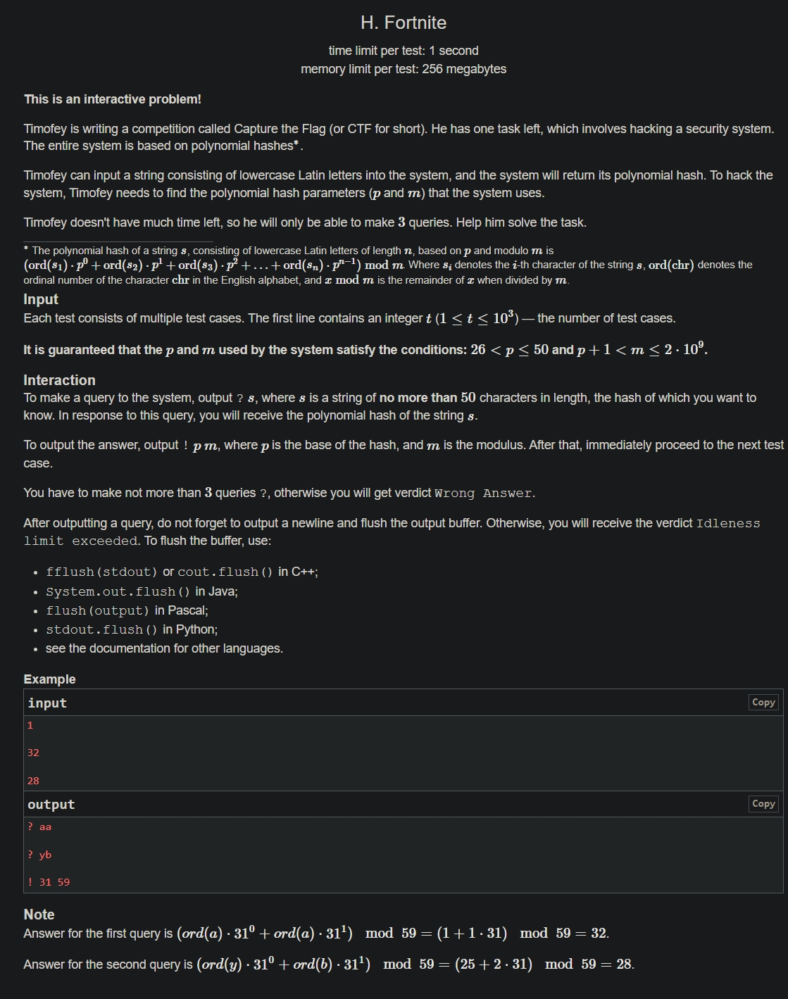

+++
author = "Nitride"
title = "CF1994H Fortnite 題解"
date = "2024-07-28"
tags = [
    "競程",
    "題解",
]
categories = [
    "競程",
]
+++
# 題目
- 連結: [Problem - 1994H - Codeforces](https://codeforces.com/problemset/problem/1994/H)
- 前置知識: 無
- 難度: 3500


# 題解
本題解主要參考自大佬$jiangly$的程式碼。

本題限制$p + 1 < m$，所以我們可以透過查詢"$aa$"得到$p + 1$的值。

接著我們另$s=$"$zzzzzzzzzz$"(10個$z$)，並查詢$s$得到$hash=(26+26p^1+26p^2+\dots+26p^9)\mod m$。令其值為$a_{0}+a_{1}p+a_{2}p^2+\dots+cp^i$。將$c$與$i$記錄下來。

此時我們知道$cp^i<m,(c+1)p^i\geq m$，若$c<25$，則我們令$s$的第$i$個字符為$z-(c+1)$ (使用ASCII編碼)。接著再查詢更新過的$s$，得到$new\_hash=(26+26p+26p^2+\dots+(26-c-1)p^i+\dots+26p^9)\mod m$。

將$new\_hash$減去$hash$得到$-(c+1)p^i\mod m$。由$(c+1)p^i\geq m$可得知$-(c+1)p^i\leq m$，故$-(c+1)p^i\mod m=-(c+1)p^i+m$。將其加上$(c+1)p^i$即可得到$m$的值。

若$c=25$，則我們令$s$的第$i+1$個字符為$z-1=y$。接著查詢更新過的$s$，得到$new\_hash=(26+26p+26p^2+\dots+26p^i+25p^{i+1}+\dots+26p^9)\mod m$。將其減去$hash$得到$-p^{i+1}\mod m=-p^{i+1}+m$，再加上$p^{i+1}$即可得到$m$的值。


# 完整程式碼
```cpp
#include <bits/stdc++.h>
#define ll long long
using namespace std;

void solve() {
	int p;
	cout << "? aa" << '\n';
	cin >> p;
	p--;

	string s(10, 'z');
	int hash, c;
	cout << "? " << s << '\n';
	cin >> hash;
	c = hash;

	int i = 0;
	ll pw = 1;
	// hash = (26 + 26p + 26p^2 + ... + 26p^9) mod m = a_0 + a_1p + a_2p^2 + ... + c*p^i
	// pw = p^i
	while (c >= p) {
		c /= p;
		pw *= p;
		i++;
	}

	if (c < 25) {
		// new_hash = (26 + 26p + 26p^2 + ... + (26 - c - 1)p^i + ... + 26p^9) mod m
		// pw = (c + 1)p^i
		// new_hash - hash = (-c - 1)p^i mod m. We know that c*p^i < m and (c + 1)p^i >= m
		// thus (-c - 1)p^i mod m = (-c - 1)p^i + m
		s[i] -= c + 1;
		pw *= c + 1;
	} else {
		// new_hash = (26 + 26p + 26p^2 + ... + 25p^(i+1) + ... + 26p^9) mod m
		// pw = p^(i + 1)
		s[i + 1]--;
		pw *= p;
	}

	// new_hash - hash = (-c - 1)p^i + m
	int new_hash;
	cout << "? " << s << '\n';
	cin >> new_hash;
	cout << "! " << p << ' ' << new_hash + pw - hash << '\n';
}

int main() {
	int t;
	cin >> t;
	while (t--) solve();
}
```