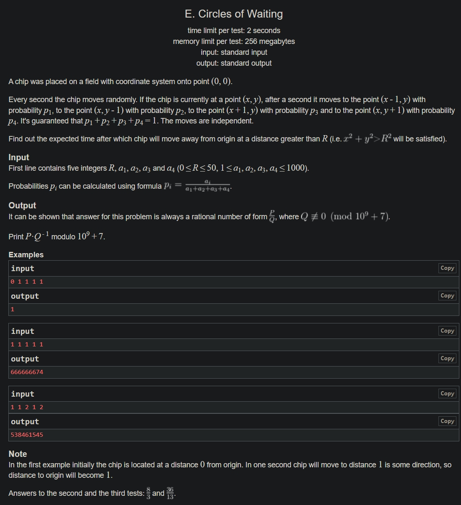

+++
author = "Nitride"
title = "CF963E Circles of Waiting 題解"
date = "2024-07-22"
tags = [
    "競程",
    "題解",
]
categories = [
    "競程",
]
+++

# 題目
- 連結: [Problem - 963E - Codeforces](https://codeforces.com/problemset/problem/963/E)
- 前置知識: 帶狀矩陣消元
- 難度: 3100


# 題解
本題解主要參考自[浅谈高斯消元拓展之 band-matrix - 洛谷专栏 (luogu.com.cn)](https://www.luogu.com.cn/article/3zspg7qj)。在看本題解前若不知道帶狀矩陣消元是什麼的話，可以先看看這篇，作者寫得很清楚。

令$f[x][y]$為從座標$(x, y)$走出圓外所需的期望步數。首先依據題意我們可以得到對於所有$x^2+y^2\leq R^2$: $$f[x][y]=a_{1}f[x-1][y]+a_{2}f[x][y-1]+a_{3}f[x+1][y]+a_{4}f[x][y+1]$$將其移項後即可得到$$f[x][y]-a_{1}f[x-1][y]-a_{2}f[x][y-1]-a_{3}f[x+1][y]-a_{4}f[x][y+1]=1$$
此時就可以用高斯消元得到答案，然而時間複雜度太大，我們需要想出更有效率的解法。

將圓內的每個點$(x, y)$從左至右，從上而下依次編號。然後我們可以發現$(x-1, y), (x+1, y)$與$(x, y)$的編號差距為$1$，$(x, y-1),(x,y+1)$與$(x,y)$的編號差距$\leq R$，因此在係數矩陣中的帶寬最多為$R$，故可以使用帶狀高斯消元來減少複雜度。>)


# 完整程式碼
```cpp
#include <bits/stdc++.h>
#define ll long long
using namespace std;

const int maxa = 8000;
const ll mod = 1e9 + 7;
ll r, a1, a2, a3, a4, sum;
int id[105][105], n, band;
int g[maxa][maxa], res[maxa];

#define ID(x, y) id[x + 50][y + 50]

vector<pair<int, int>> pos;
ll qpow(ll a, ll b) {
  ll res = 1;
  while (b) {
    if (b & 1) res = res * a % mod;
    a = a * a % mod;
    b >>= 1;
  }
  return res;
}

void gauss(int n, int band) {
  for (int i = 1; i <= n; i++) {
    if (!g[i][i]) {
      for (int j = i + 1; j <= min(n, i + band); j++) {
        if (g[j][i]) {
          swap(g[i], g[j]);
          break;
        }
      }
    }

    if (!g[i][i]) continue;
    ll inv = qpow(g[i][i], mod - 2);
    for (int j = i + 1; j <= min(i + band, n); j++) {
      ll div = g[j][i] * inv % mod;
      for (int k = i; k <= min(i + 2 * band, n); k++) {
        g[j][k] = (g[j][k] - div * g[i][k] % mod + mod) % mod;
      }
      g[j][n + 1] = (g[j][n + 1] - div * g[i][n + 1] % mod + mod) % mod;
    }
  }

  for (int i = n; i >= 1; i--) {
    res[i] = g[i][n + 1];
    for (int j = i + 1; j <= min(i + 2 * band, n); j++) {
      res[i] = (res[i] - 1ll * g[i][j] * res[j] % mod + mod) % mod;
    }
    res[i] = res[i] * qpow(g[i][i], mod - 2) % mod;
  }
}

int main() {
  cin.tie(0)->sync_with_stdio(0);

  cin >> r >> a1 >> a2 >> a3 >> a4;
  sum = a1 + a2 + a3 + a4;
  sum = qpow(sum, mod - 2);
  a1 = a1 * sum % mod;
  a2 = a2 * sum % mod;
  a3 = a3 * sum % mod;
  a4 = a4 * sum % mod;

  for (int i = -r; i <= r; ++i) {
    for (int j = -r; j <= r; ++j) {
      if (i * i + j * j > r * r) continue;
      pos.push_back(make_pair(i, j));
      ID(i, j) = pos.size();
    }
  }

  n = pos.size();
  band = 1;
  // res[x][y] - a1 * res[x - 1][y] - a2 * res[x][y - 1] - a3 * res[x + 1][y] - a4 * res[x][y + 1]
  for (auto u : pos) {
    int x = u.first, y = u.second;
    g[ID(x, y)][ID(x, y)] = 1;
    g[ID(x, y)][n + 1] = 1;
    if (ID(x - 1, y)) {
    	g[ID(x, y)][ID(x - 1, y)] = -a1 + mod;
    	band = max(band, abs(ID(x, y) - ID(x - 1, y)));
    }

    if (ID(x, y - 1)) {
      g[ID(x, y)][ID(x, y - 1)] = -a2 + mod;
      band = max(band, abs(ID(x, y) - ID(x, y - 1)));
    }

    if (ID(x + 1, y)) {
      g[ID(x, y)][ID(x + 1, y)] = -a3 + mod;
      band = max(band, abs(ID(x, y) - ID(x + 1, y)));
    }

    if (ID(x, y + 1)) {
      g[ID(x, y)][ID(x, y + 1)] = -a4 + mod;
      band = max(band, abs(ID(x, y) - ID(x, y + 1)));
    }
  }

  gauss(n, band);
  cout << res[ID(0, 0)];
}
```