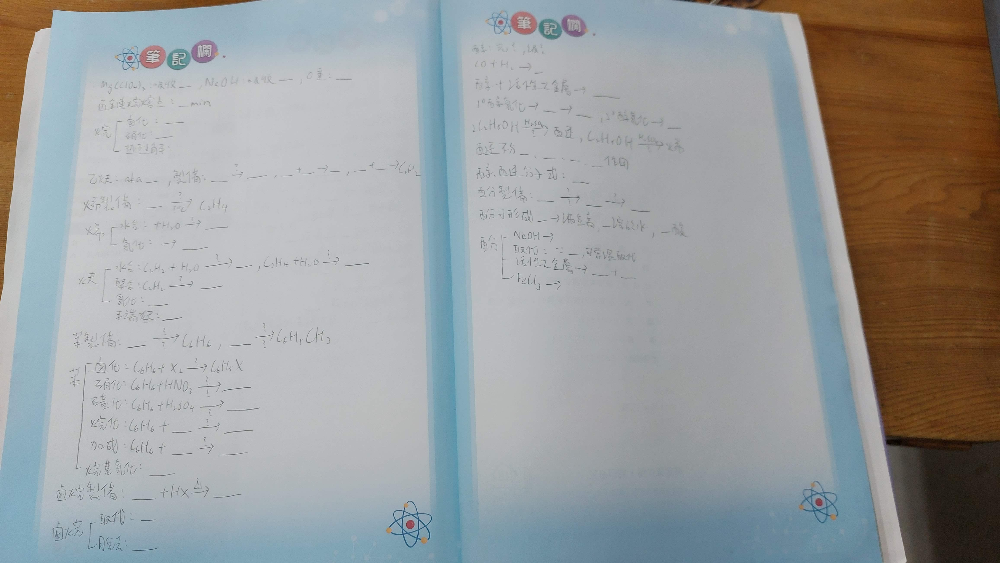
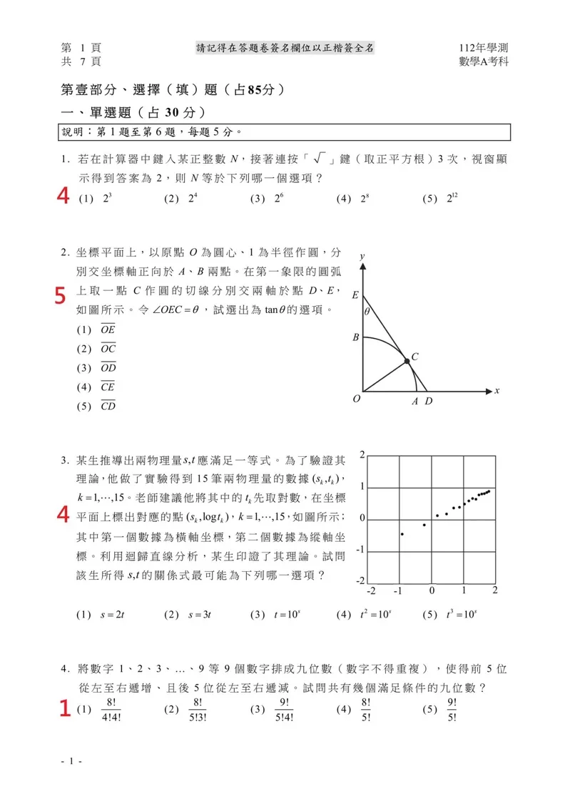

+++
author = "Nitride"
title = "學測讀書技巧分享"
date = "2023-10-15"
description = "跟大家分享一些我覺得滿有用的讀書方法"
tags = [
    "高中",
    "學習技巧",
]
categories = [
    "學習技巧",
]
image = "b.jpg"
+++

# 學測讀書技巧分享

# 前言

我在高中的時候有研究一些讀書方法，想試試看要怎麼讀書才能最有效率，用盡量少的時間達到想要的成果(因為我很懶不喜歡讀書)。我認為比起學習課本上的知識，學習「如何學習」比較有用。以下是我試過覺得有用的讀書方法，大家可以參考一下。

(雖然但是，我考前一天緊張到整晚沒睡，所以最後考得不太理想，以下是我的成績)

# 第一階段: 學習

## 2個常見但沒有效率的學習法

### 做筆記

做筆記對於增強記憶其實沒什麼用，而且很耗費時間。筆記應該是當作「創作性」的用途，比如說你對於當前學習的知識有了什麼新發現，或是獨特的想法，也可能是你對於當前的概念不了解，想透過寫筆記的方式視覺化以增強理解，而不是用來幫助記憶。要記憶知識的話，稍候會介紹一個更有效率的方法。假如說你作筆記是為了編排課本上的知識以便閱讀，那其實可以直接看講義就好，大部分的講義都把知識點整理得很清楚，基本上要應付學測或段考是沒問題的。我個人是對學測範圍完全沒做筆記，把講義上的東西背熟再大量刷題找弱點就好了，這樣可以省下很多時間。

### 畫重點

畫重點有助於你在課本中更快的找到重要的知識，但對於增強學習效果其實沒什麼用，如果一開始就是讀講義的話那更是可有可無，但是如果你有這個習慣的話也不一定要改掉，讀得順手就好了。我自己是上高中之後就沒有再畫重點，有講義就直接讀講義不讀課本，因為講義都直接把重點整理好了，讀起來也比課本輕鬆很多。

## 3個高效的學習法

### Active Recall

Active Recall(主動回憶法)顧名思義就是透過回想學習的內容，進而深化其在大腦中的記憶。和作筆記跟重複讀講義不同的是，Active Recall正好與我們考試時從腦中提取記憶的過程相近，研究證實更能夠幫助我們在考試時回想出正確答案，同時也可以避免我們讀筆記跟講義時常常有的「以為自己記住了，但其實沒記住」的誤區。

已經有很多研究測試後發現，僅使用Active Recall的人們在考試上的表現幾乎都比做筆記跟重複讀的好。而且就效率而言，Active Recall所需的時間也遠比做筆記來得少。此外，也可以透過憑記憶畫心智圖或其他方式，達到回想的效果，無論是甚麼方式，最重要的是提取記憶的過程。基本上背科(社會、生物、地科)靠這招搭配大量刷題就可以穩15級了。

那關於Active Recall的方法，我平時會使用的主要有3種，接下來介紹給大家。

1. 直接回想: 在讀完一頁後，馬上回想剛剛讀到的內容，進而深化記憶。
2. 遮關鍵字回想: 把講義讀過一遍之後，再翻一遍，然後這次把每頁需要背的東西用手遮起來，看自己能不能回想，如果不行的話就把這個東西再讀一次並試著記起來。就這樣把考試範圍翻完之後再重新讀一次（只要看記不起來的部分就好)，一直重複上面的動作直到把所有要看的東西記起來就好ㄌ。
3. 填空回想: 如果要背的東西有很多很細，那我會以填空題的方式，把每個知識點寫成一個題目，並把要背的東西挖空，之後在反覆測試看自己對於哪個地方比較不熟悉。這個方法可以跟上一個方法進行搭配，如果是容易背的東西就用第2個方法就好，稍微瑣碎或難記的知識的再使用這個方法即可(因為寫題目很花時間)。對於學測而言，通常不會考到太細的知識，所以我當時考學測就全靠前2個方法，不過段考可能就需要用到第3種方法，以下是我高三下段考有機化學所做的填空題。

### Spaced Repetition

相信大家對於「學過的東西又忘」這件事感到相當困擾。根據艾賓浩斯遺忘曲線，我們對於一件事的記憶會隨時間衰退，如下圖所示:

(圖片來源: [Retrieval: Getting and Forgetting (Part 8 of 14) | Sense and Sensation](http://www.senseandsensation.com/2013/03/retrieval-getting-and-forgetting-part-8.html))

那麼要如何挽救我們辛苦一天讀書的成果呢? 很簡單，這要持續地複習就好了。透過每次複習後逐漸拉長與下一次複習的間隔，最後就可以深化成堅不可摧的記憶唷。

(圖片來源: [淺談記憶法（二）遺忘曲線與艾賓浩斯記憶法 - SoLeisure](https://www.soleisure.com.hk/article/T2))

至於間隔的時間，有很多種說法。我自己使用的是1天→2天→1周→1個月。不過由於準備學測時的大量刷題本身就是一種複習與記憶提取，所以我當時是沒有去使用這個方法，只有在背單字時使用(可以參考我等等會提到的背單字法)。

還有一些軟體有提供間隔複習的功能，例如Anki、Quizlet等等，有些人會使用這些軟體背單字，但我覺得用這個背單字效率不夠高，光是輸入就要花很多時間，但如果你原本就使用電腦學習(例如讀課本的pdf、或要記憶網路上的內容等等，這通常大學以後才比較需要)，用這些軟體的效率就會提高許多。

## 我所使用的講義

- 數學: 徐式分冊
- 物理、化學、生物、地科: 新關鍵
- 國文: 大滿貫、大講堂文言文15篇
    - 很多人推薦搶救國文大作戰，但我其實不推，裡面的編排方式相較於大滿貫更不易閱讀，而且有許多瑣碎且學測不會考的知識，如果對國文沒興趣只是想應付學測的話，讀大滿貫就好了。
- 英文: Kuso 酷文法
- 地理、歷史、公民: 大滿貫

## 各科的一些小Tips

### 數學

- 這裡推薦一本書—George Polya的<<怎樣解題>>，裡面有教了許多種解題的方法，讀完之後數學能力應該會有所提升。
- 寫題目時抱持著「每一題一定有解」的觀念，將題目給你的線索「全部」列出來(這很重要)，再看看你可以用這些線索推敲出甚麼結果(這也很重要)，因為最終的答案**一定**可以靠題目給你的線索解答出來。
- 如果看著題目給你的線索卻還沒有頭緒，可以看答案要你求甚麼，接著在反推要怎麼樣才能求得答案所需要的條件，就這樣一步步反推，推至你已經知道的條件，如此一來就可以透過逆推法來解題。

### 自然

- 物理、化學需要計算的部分，就用跟數學解題時類似的方式，來求得答案。相信經過選修物理、化學磨練過的大家，對於學測範圍的計算部分相當的得心應手。
- 其他需要記憶的部分，就透過前面提到的Active Recall法來解決。

### 英文

- 學習一個語言最重要的是培養「語感」，而培養語感的方法就是盡量多接觸這個語言。平常可以多看一些英文影片、小說、文章之類的。小說的話我推薦Tess Gerritsen的懸疑推理小說，真的很好看.w.，不過字數有點多，一開始可以先挑字數少一點的小說看。
- 英文基本上把單字、片語、文法背熟就可以全對了。至於要如何有效率的背單字可以參考我之前學習歷程做的

[兩個月記牢一萬五千單字.pdf](%25E5%2585%25A9%25E5%2580%258B%25E6%259C%2588%25E8%25A8%2598%25E7%2589%25A2%25E4%25B8%2580%25E8%2590%25AC%25E4%25BA%2594%25E5%258D%2583%25E5%2596%25AE%25E5%25AD%2597.pdf)

### 國文

- 國綜
    - 國學常識
        - 把古文15篇中出現的字詞解釋與讀音背熟，並熟悉他們的相近字。接著再把其他國學常識背熟即可
    - 閱讀理解、混合題:
        - 寫的時候先看題目問你甚麼，如此一來在閱讀時才能夠有比較清楚的方向，也更能夠記住重要的內容。
        - 研究顯示，在閱讀時用手指或筆追蹤你所讀到的內容，可以有效提高閱讀速度以及理解力。
        - 如果平常寫閱讀測驗正確率沒辦法達到8成的話，可以每天練習寫<<古今悅讀100>>，並找出自己錯誤的原因，等到正確率有個8、9成(扣掉粗心錯的)以後，大概1~2個禮拜寫一次閱讀測驗維持手感就好了喔。
- 國寫
    - 基本上就是常看學測歷年佳作、作文比賽得獎作品或是對岸的高考滿分作文，試著內化他們所表達的東西，接著再用自己的話表達一次，看看自己寫的跟他們寫的有哪裡不同，並找出可以改進的地方。
    - 多多練習是關鍵，可以的話盡量請老師改自己練習寫的內容，並找出不足的地方加以改進。
    - 在開始寫之前先想好結尾會是甚麼，接著通篇保持最後的立場，不要在多個觀點間猶豫不定。拿高分的首要重點是看你能不能清楚有條理的表達自己的想法，其次才是詞藻的優美度。

### 社會

- 基本上使用Active Recall搭配大量刷題，就可以15了喔

## 時間管理

- 我平常會使用上課時間來自習，這樣就等於一天多了5小時左右的自習時間(扣掉一些不能自習的課)，而且這樣回家就不用讀書了。
- 休息很重要，不要整天都在讀書，適當休息的學習成效會比整天都在讀書要好很多。

# 第二階段: 刷題

將每科的講義大概看完後，刷題就是接下來最重要的關鍵。透過大量且有效的刷題，考試時才能更加得心應手，也是區分頂標跟15級的關鍵。

## 快速刷題技巧

- 對於理科而言，如果你已經知道接下來怎麼算，就沒必要把整題都算完，可以直接跳下一題。如此一來，你在刷題時就會發現有很多題是一眼就知道可以直接跳過的，沒必要花費多餘的時間，至於有些比較算法不明顯的題目，只需要把式子列至你知道接下來怎麼算即可。用這個方法，大約15\~30分鐘就可以刷完一張自然模擬考考卷、20\~40分鐘就可以刷完一張數學考卷喔。
- 對於背科而言，如果題目考的是你很熟悉的範圍，那就可以直接跳過。如果你對閱讀測驗也很有把握，那也可以直接跳過。不過遇到那種題幹稍長的題目，還是建議看清楚他要問甚麼比較好。

## 錯題本

顧名思義就是把寫錯的題目記錄在一個本子上，之後再重複複習。這裡可以用拍照代替，之後也比較方便把照片放到間隔複習的軟體(如Anki)上，比手抄省下很多時間。這個方法我到2023年5月才開始使用，所以準備學測時沒有用到，不過我覺得這是一個很有用的方法。

## 刷題的意義

- 刷題時也可以想想，和這題有關的其他知識，我是不是都記清楚了，而不是只專注在眼前題目問你的東西，不要只為了答對眼前的題目而刷題，你這題是錯是對都不是重點，重點是你從刷題的過程中學習到了甚麼，並要怎麼應用在正式考試上。

# 第三階段: 應試

## 過程

- 如果你知道眼前的題目會花你很多時間，那就先跳過去寫後面的題目，不要因為在這題卡太久而導致後面該拿的分數沒拿，並在跳題的保持平靜的心態，不要因此慌了手腳，畢竟如果這道題真的很麻煩，那大家也很可能會答錯。(但記得最後要回來寫!!!)
- 寫數學的順序: 單選→填充→混合→多選，因為多選通常最麻煩，放最後比較不會心態崩，至於填充跟混合的順序可以調換，如果混合很簡單的話。

## 一些偷吃步小技巧

注意: 以下方法只適用於學測 / 指考等大考中心的考試，對模擬考沒有用。

### 領域展開法

以112數A單選最後一題為例

嗯，這題一看就是很麻煩的窮舉，如果要算的話可能需要花3~5分鐘，不過當時我用了一招，5秒鐘就知道答案ㄌ。先來看看我當時的視角。

有沒有發現，已經到了單選最後一題，卻還沒有出現過3，所以這題答案就是3(ㄏㄏ)。

這是大考中心的命題規則，如果題目數比選項數多的話，每個選項一定會出現至少一次，我檢查了近五年的答案皆是如此。所以如果你已經寫到單選的最後一題，卻還沒出現過某個選項，那最後一題的答案9成以上就是那個選項。檢查的時候甚至不用檢查最後一題，檢查前面就好了。(不過用這個方法的時候，要確定前面都有寫對)

如果是分科數甲的話，由於單選只有3題，所以一定不會有重複的答案，這是大考中心為了避免有人靠猜題得到較高的分數的應對措施，不過我們正好可以用這個規則來猜答案.w.。

### 多選判斷法

- 分科 / 指考的多選，答案不是2個選項就是3個選項(數甲是2個選項居多)，不信的話可以去大考中心官網上確認。因此，可以透過這招來加速寫題的過程，或是刪掉不確定的答案。

### 其他一些推薦影片

[不會寫的題目也能90%猜對的方法？  世界冠軍：用考試讀心術 ｜ 考試讀心術  第一集](https://youtu.be/fWXy7xcyn4o?si=cqrxTY5XThW5yGR1)

[如何快速提高考試分數？ ​ 多選題猜答案的最優數學策略](https://youtu.be/HbARlwN5nRA?si=JlT6a08zV-APFhAa)

# 補充: 5本有助於學習的書

以下是我讀過，對我學習方式影響最大的5本書，在這邊推薦給大家

## 大腦什麼都記得住

這本書是由美國記憶比賽冠軍所寫，裡面介紹了許多記憶的方法，內容非常實用。

[大腦什麼都記得住！用更少的力氣記住更多的東西，四屆記憶冠軍親授的「超效率無極限記憶術」](https://www.books.com.tw/products/0010834974)

## 超速學習

這本書對於要怎麼快速且系統性的學習一個領域提供了相當詳細的教學，如果想要學習新事物，這會是一本很有用的書籍。

[超速學習：我這樣做，一個月學會素描，一年學會四種語言，完成MIT四年課程](https://www.books.com.tw/products/0010855836?loc=P_br_r0vq68ygz_D_2aabd0_C_1)

## 大腦喜歡這樣學

這本書把許多高效率的讀書方法大致都講過了，如果你看完這篇文章後對學習技巧感到興趣，那我建議你可以來讀這本書喔

[大腦喜歡這樣學：先認識自己的大腦，找到正確的思考路徑，就能專注、不拖延，提高記憶力，學會如何學習(二版)](https://www.books.com.tw/products/0010764994)

## 怎樣解題

這本書以許多的面向，講述了各種解題的策略與技巧。如果你想要增強自己的解題能力，這本書應該會有所幫助。

[怎樣解題](https://www.books.com.tw/products/0010786452)

## 刻意練習

這本書詳細的講述了要在一個領域變成專家，比起天賦更重要的是訓練的方式。透過這本書教的練習方式，你也可以達成原先所認為不可能的事，取得驚人的成就喔。

[刻意練習：原創者全面解析，比天賦更關鍵的學習法](https://www.books.com.tw/products/0010752714?loc=P_br_r0vq68ygz_D_2aabd0_C_1)

# 後記

每個人適合的讀書方法不盡相同，如果你覺得我的讀書方法對你沒什麼用，那也可以試著找找看對自己最有效的讀書方式喔。那就祝各位學弟妹考試順利，學測就上!

還有對於某些科系而言，二階才是重點，大家記得好好準備二階考古題或是口試喔~
